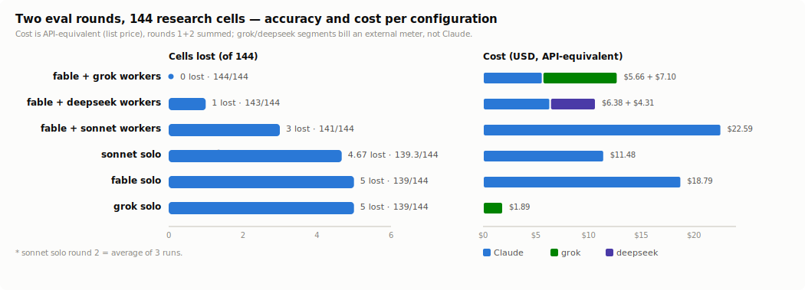

# grok-delegate

A [Claude Code](https://claude.com/claude-code) skill that delegates coding, review, and research
tasks to the [grok CLI](https://x.ai) (xAI, `grok-4.5`) — as a subagent-like offload. Claude Code
calls grok headless via the Bash tool, in a **read-only** or **autonomous** mode, and can fan out
several grok workers in parallel.



<sub>Two controlled eval rounds, 144 research cells: the grok-worker configuration was the only
one with zero wrong cells, at the lowest Claude-side spend of every run — method and full numbers
in [`docs/orchestration-eval.md`](docs/orchestration-eval.md).</sub>

## Why

- **Independent cross-check.** grok is a different model family, so it has a different set of blind
  spots than Claude — useful for second opinions and code review.
- **Separate quota.** grok bills to your xAI account, not your Claude usage limit. Offloading work
  to it does not eat into Claude's quota.
- **Safe by construction.** In headless mode grok runs tools with no human to approve them, so a
  bare `grok -p` will edit files. This skill's wrapper removes the write/shell tools for read-only
  modes via a `--tools` allowlist — `--permission-mode` is **not** a reliable guard (see below).

## Install

As a plugin (also registers the `grok` subagent below automatically):

```
/plugin marketplace add ktseo41/grok-delegate
/plugin install grok-delegate@ktseo41
```

Or clone directly into your Claude Code skills directory so the folder name matches the skill name:

```bash
git clone https://github.com/ktseo41/grok-delegate.git ~/.claude/skills/grok-delegate
```

Pick one method — a plugin install plus a skills-dir clone would register the skill twice.

Or use the installer (copies into `~/.claude/skills/grok-delegate` by default):

```bash
./install.sh                    # -> ~/.claude/skills/grok-delegate
./install.sh --dest /path       # -> /path/grok-delegate
./install.sh --with-subagent    # also install the 'grok' subagent (see below)
```

### Optional: use grok as a native subagent

Pass `--with-subagent` to also copy `agents/grok.md` to `~/.claude/agents/grok.md`. It is a thin
dispatcher subagent (`tools: Bash`, `model: sonnet`) that runs `grok-run.sh` in its own context and
relays only a summary — so you get `@grok` invocation, `/tasks` monitoring, and real parallel fan-out
via the Agent tool, with grok's verbose output kept out of your main conversation. The heavy
reasoning stays on grok (xAI quota); only the small courier turn bills to Claude. `model: sonnet` is
pinned so the courier does not inherit an expensive main-session model. Delegate with, e.g.,
`@grok review the diff in src/auth`. Without it, delegation still works by calling the wrapper directly.

For a large generated artifact (a translated page, a whole file), skip the subagent and call the
wrapper directly with output redirected to a file — `grok-run.sh review "…" > out.html` — since the
courier would otherwise spend tokens shuttling the whole artifact through its context. Rule of thumb:
want a summary → `@grok`; want the raw artifact → direct wrapper + `> file`.

### Requirements

- The `grok` CLI on your `PATH`. Verified against grok 0.2.111 (read-only canary last re-run 2026-07-23).
- Authenticated once: `grok login` (or `XAI_API_KEY` for CI).
- Minimum grok: 0.2.98 for `research`, 0.2.111 for `--verify` (`grok update`).

## Usage

Claude Code invokes the skill automatically when you ask it to delegate to grok. You can also call
the wrapper directly:

```bash
scripts/grok-run.sh review      "<prompt>" [grok args...]  # read-only, no web   (default)
scripts/grok-run.sh research    "<prompt>" [grok args...]  # read-only + web search/fetch
scripts/grok-run.sh fix         "<prompt>" [grok args...]  # AUTONOMOUS: edits files + shell
```

Examples — each is a user ask mapped to the delegation it triggers:

```bash
# "grok review this diff" — read-only, cannot touch files. review has no git/shell, so
# grok can't compute a diff itself: pipe it in via "-" (stdin), or name files for it to read.
{ echo "Review this staged diff for correctness and security bugs. Be concrete: file:line + why."; \
  git -C /path/to/repo diff --staged; } | scripts/grok-run.sh review - --cwd /path/to/repo

# "ask grok how <LIBRARY> handles retries" — read-only + web
scripts/grok-run.sh research \
  "How does <LIBRARY> implement retry/backoff? Cite the specific files and docs." \
  --cwd /path/to/repo

# "have grok fix the failing test" — autonomous, isolated in a git worktree
scripts/grok-run.sh fix \
  "Fix the failing test in tests/test_parser.py and run pytest until green." \
  --cwd /path/to/repo -w grok-fix

# "review these modules in parallel" — one background run per target, then collect
scripts/grok-run.sh review "Review src/a.py for concurrency bugs. file:line + why." --cwd /path/to/repo &
scripts/grok-run.sh review "Review src/b.py for concurrency bugs. file:line + why." --cwd /path/to/repo &
wait
```

Pass-through flags after the prompt: `-m grok-4.5`, `--max-turns N` (default 30), `--effort high`,
`-w/--worktree NAME` (space or `=` form both work). Env: `GROK_MODEL`, `GROK_MAXTURNS`.

**Reviewing a diff:** `review` mode has no git or shell, so grok cannot run `git diff` — pass the
prompt as `-` to stream instructions + diff from stdin (delivered to grok via `--prompt-file`, so
there is no argument-length limit and grok sees the whole diff):

```bash
{ echo "Review this staged diff for correctness/security. file:line + why."; \
  git -C /path/to/repo diff --staged; } | scripts/grok-run.sh review - --cwd /path/to/repo
```

### Modes

| Mode | Tools | Use for |
| --- | --- | --- |
| `review` (default) | `read_file`, `grep`, `list_dir` | Second opinion, code review — cannot modify the repo. |
| `research` | read-only + `web_search`, `web_fetch` | Comparisons, current docs/facts. |
| `fix` | full toolset + `--always-approve` | Autonomous implementation. Pair with `-w` for isolation. |

**Web-collection gate (research mode).** The worst research failure observed in practice is a
plausible answer produced **without any web call** — exit 0, normal length, written from model
memory (4 of 12 workers on a real fan-out). The wrapper reads grok's own usage signals after each
`research` run and **fails the run (non-zero exit)** if no `web_search`/`web_fetch`
was ever called; the body is still printed for inspection. Bypass deliberately with
`GROK_ALLOW_NOWEB=1`. Every run also prints a `[grok-usage]` trailer
(`ctxTokens=… wallSec=… toolCalls=… tools=…`) so you can see what the delegation cost on the xAI side.

## The safety detail

`--permission-mode` does not make grok read-only in headless mode. Tested against grok 0.2.93 by
asking grok to append to a canary file under each mode:

| `--permission-mode` | Wrote the file? |
| --- | --- |
| `default` | yes |
| `acceptEdits` | yes |
| `auto` | yes |
| `bypassPermissions` | yes |
| `plan` | yes |
| `dontAsk` | yes |

**No permission mode blocked the write** in headless mode — there is no human to approve, so the
tools just execute. The only robust guard is removing the tools entirely with `--tools`, which is
what `review` (and, when it can build, `research`) does; `--disallowed-tools` is not a safe
substitute — it also let grok write in testing. `fix` deliberately opts back in with `--always-approve`.

**The read-only guarantee is regression-tested.** `evals/canary.sh` points `review` at a throwaway
sandbox and orders grok to write four ways — append, create, shell `touch`, and an absolute path
*outside* `--cwd` — then asserts nothing landed (detected by a full before/after tree snapshot, not a
fixed list of filenames). A `fix`-mode positive control proves grok is genuinely write-capable, and a
`git status` guard proves the test itself didn't dirty the repo; it exits non-zero if any write leaks.
`evals/stub-regression.sh` covers the wrapper's argument handling offline, at zero xAI quota. Run both
after touching the wrapper — see [`evals/README.md`](evals/README.md).

**Historical bug (grok < 0.2.98, fixed upstream):** a `--tools` allowlist that includes a web tool
(`web_search`/`web_fetch`) used to fail to build the session, so `research` failed closed. Fixed
upstream in grok 0.2.98. The wrapper still warns (never blocks) at startup if it detects a grok
older than that, and a research build error now gets one automatic retry before it fails closed —
on a build error it reports this clearly rather than dropping the read-only guard to work around it.
When you still need the web lookup and `research` keeps failing, don't weaken it — pick a path by
quota: `review` for read-only code work; **with your explicit OK to let grok write**, `fix -w <name>`
(fix has web, runs isolated in a worktree, stays on grok's xAI quota); or, if you ask first, Claude's
own WebSearch/WebFetch (spends Claude's quota — the thing delegating saves). Never silently
substitute one for another.

## Does delegating actually help?

Measured, twice. Two controlled eval rounds (12-central-bank lookup, then a 12-currency
real-policy-rate task with planted judgment traps) compared **fable orchestrating one grok
worker per topic** — the orchestrator only splits and assembles, no re-verification pass —
against solo runs and other worker models. The grok-worker setup was the only one with zero
wrong cells across both rounds (**144/144**), at the lowest Claude-side spend of any run,
while solo fable and solo grok failed the *same* trap cells; deepseek workers came within
one cell (143/144) once their channel was fixed but run 5–6× slower, and sonnet workers
let a wrong index choice through. The win comes from one narrow
topic per worker plus the wrapper's web-collection gate; a re-verification pass adds nothing
with grok workers and is only insurance for less reliable ones. Method, numbers, score/token/cost charts, and a reusable checklist for
benchmarking other delegates: [`docs/orchestration-eval.md`](docs/orchestration-eval.md).

## License

[MIT](LICENSE)
