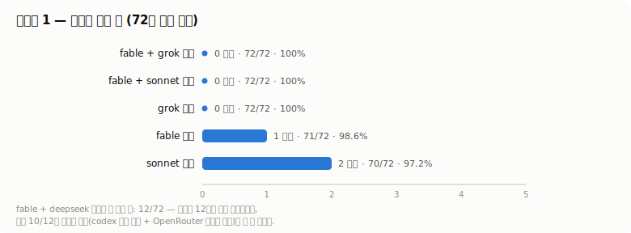
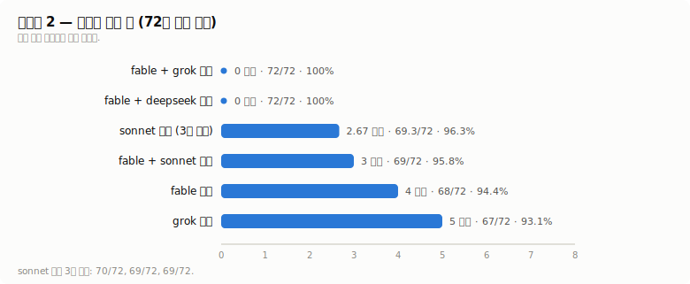
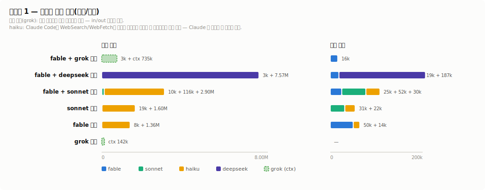
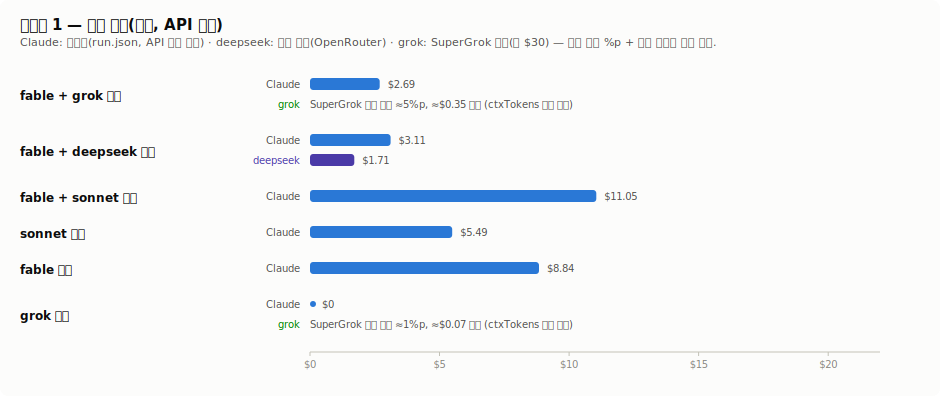
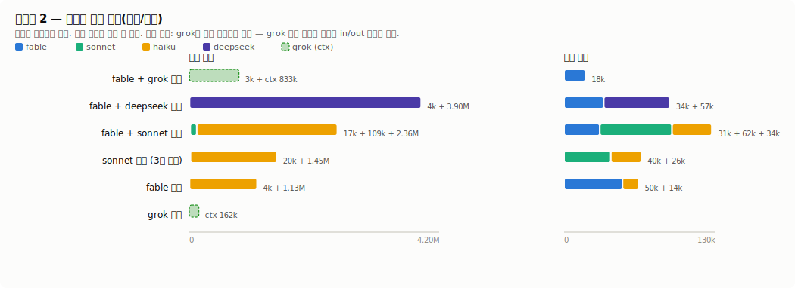
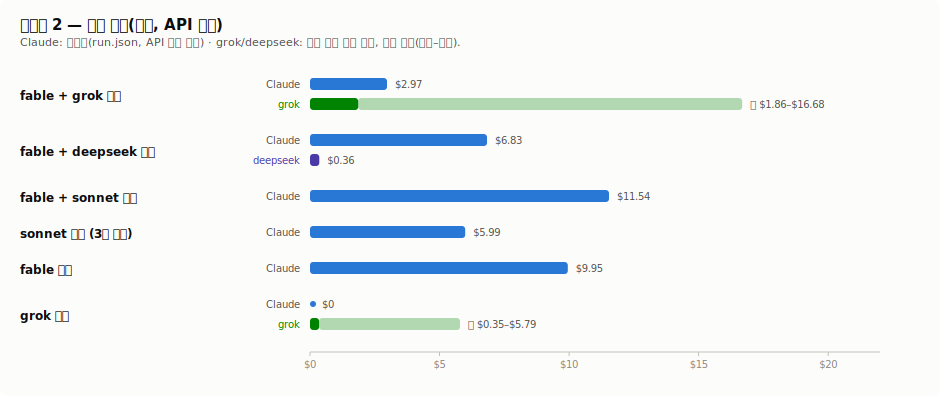

# grok 위임, 실제로 값어치가 있나? — 오케스트레이션 평가

두 라운드의 실제 웹 리서치 과제를 수행해, **fable이 오케스트레이터로서 grok
워커들에게 수집을 맡기는 조합**이 정말 나은지 확인했다. 

| 조합 | 라운드 1 (조회형 과제) | 라운드 2 (판단 함정형 과제) |
| --- | --- | --- |
| **fable + grok 워커** | **72/72 (100%)** — 워커 12/12 1차 완주, 재시도 0회 | **72/72 (100%)** — 워커 12/12 |
| fable + sonnet 워커 | **72/72 (100%)** — 워커 12/12 | 69/72 (95.8%) — 잘못된 지수 선택이 안 걸러지고 통과 (연쇄 3셀) |
| sonnet 단독 | 70/72 (97.2%) | 69.3/72 (96.3%) — 3회 실행(70·69·69) 평균 |
| fable 단독 | 71/72 (98.6%) | 68/72 (94.4%); 발표 시점 함정 2개에 모두 걸림 |
| grok 단독 | **72/72 (100%)** | 67/72 (93.1%) — fable 단독과 정확히 같은 함정에 걸림 |
| fable + deepseek 워커 | 71/72 (98.6%) — 워커 12/12 완주; 유일한 손실은 Fed 결정일에 발효일을 적은 1셀 | **72/72 (100%)** — 워커 12/12 완주 |

채점은 라운드마다 하나의 절차로 통일했다 — 어느 리포트가 어느 조합 것인지 모르는 채점
세션 하나가 같은 정답표로 채점하고(블라인드), 못 채운 셀은 0점, 분모는 전 조합 72
(상세는 아래 "결과를 신뢰할 수 있게 만든 장치" 절).

만점의 비결은 좁은 범위다: 워커 하나가 주제 한 곳만 맡고, "모든 주장은 이 세션에서 실제로
가져온 페이지에서만"을 강제했다. 이 조건에서 grok 워커는 두 과제 유형 모두 만점,
deepseek 워커도 실행 채널 — 모델 자체가 아니라 모델에게 일을 전달하는 실행 경로(여기서는
codex CLI + OpenRouter)의 설정·게이트·재시도 규칙 — 을 고치자 두 라운드 143/144(판단
함정형은 만점)로 사실상 동급이었다 — 다만 grok의 5–6배 느리다. sonnet 워커만 판단
함정형에서 잘못된 지수 선택이 그대로 실렸다(69/72).

*워커 결과를 오케스트레이터가 하나하나 재검증·교정하는 변형도 실험했지만, 목적이
workflow 테스트가 아니라 grok 위임 검증이므로 제외했다 — grok 워커 기준 점수는 같은
만점, Claude 소모만 2–3배. 원자료는 실험 워크스페이스에.*

## deepseek는 왜 여기 있나

이 스킬을 만든 나는 평소 리서치를 deepseek에 위임해 써 왔다. 방법은 단순하다 — Claude에서
codex CLI를 부르는 흐름은 이미 자주 쓰는 패턴이라, 그 호출의 모델만 deepseek으로 갈아끼우면
익숙한 경로를 그대로 둔 채 deepseek의 훨씬 낮은 단가만 취할 수 있다. ChatGPT 구독을 쓰지 않는
입장에선 더 그랬다. 이미 이렇게 위임해 쓰던 방법이라, 내가 실제로 일하는 방식이 grok 위임과
견줘 어느 정도인지 확인하려고 비교군에 넣었다.

## 과제 내용

- **라운드 1 — 조회형.** 12개 중앙은행의 현재 통화정책 설정, 필드 6개씩(정책수단명, 값,
  최근 변경일, 크기/방향, 다음 회의, 결정문 원문 인용 + URL). 공식 출처만 허용.
  12 × 6 = 72셀. 싱가포르(MAS) 웹사이트가 실험 기간 내내 전면 점검 중이었지만 도메인
  한정 검색으로 전 셀 채점이 가능했다. 전 조합이 97–100%에 몰렸고 변별력이
  없었다 — 조합 간 차이는 세부 수치 1건과 인용 필드에서만 났다.
- **라운드 2 — 판단 함정형.** 12개 통화권의 실질 정책금리: 정책금리(중앙은행) − 그 은행이
  **공식적으로 타겟팅하는 물가지수**의 최신 전년동월대비 상승률(통계청 발표), 소수점 둘째
  자리까지. 필드마다 함정을 심었다:
  - **지수 선택**: 공식 타겟 지수와 실무에서 자주 인용되는 지수가 다른 나라들(미국은 CPI가
    아니라 PCE, 스웨덴은 CPIF, 노르웨이는 CPI vs CPI-ATE, 일본은 종합 vs 신선식품 제외).
  - **발표 시점**: 물가 통계는 속보치(잠정)가 먼저 나오고 나중에 확정치로 바뀐다. 출처가
    "잠정"이라고 명시한 라벨을 존중하는지, 실행 며칠 전에 나온 최신 발표를 놓치지 않는지.
  - **출처 귀속**: 물가지수의 원출처는 중앙은행이 아니라 통계청이다.
  - **연쇄 채점**: 지수를 잘못 고르면 그 값으로 계산한 산술 셀도 함께 감점.

  12 × 6 = 72셀, 셀당 1점.

> 여기서 "함정"이란 일부러 틀리기 쉬운 지점을 문제에 심어 두는 것을 말한다 — 모델이 얼마나
> 아느냐가 아니라, 틀리기 쉬운 곳에서 실제로 틀리는지를 보기 위한 장치다.

## 토큰과 잠재 비용 (모델별 원시값)

### 라운드 1

**모델별 원시 토큰**

| 조합 | 모델 | 세션⁵ | in | out | cache write | cache read | ctxTokens³ |
| --- | --- | ---: | ---: | ---: | ---: | ---: | ---: |
| fable + grok 워커 | fable-5 | 1 | 3,025 | 16,184 | 73,594 | 375,824 | — |
| | grok-4.5 | 12 | — | — | — | — | 735,055 |
| fable + deepseek 워커 | fable-5 | 1 | 3,176 | 18,750 | 68,874 | 760,200 | — |
| | deepseek-v4-flash | 15 | 7,566,286¹ | 187,377² | — | 11,094,784¹ | — |
| fable + sonnet 워커 | fable-5 | 1 | 10,123 | 24,916 | 89,685 | 787,448 | — |
| | sonnet-5 | 12 | 116,460 | 52,193 | 409,152 | 2,567,989 | — |
| | haiku-4.5⁴ | — | 2,895,427 | 30,475 | 0 | 0 | — |
| sonnet 단독 | sonnet-5 | 1 | 18,816 | 31,487 | 153,605 | 5,962,593 | — |
| | haiku-4.5 | — | 1,599,289 | 22,395 | 0 | 0 | — |
| fable 단독 | fable-5 | 1 | 8,330 | 49,839 | 133,803 | 1,939,729 | — |
| | haiku-4.5 | — | 1,361,978 | 14,115 | 0 | 0 | — |
| grok 단독 | grok-4.5 | 1 | — | — | — | — | 141,786 |

¹ deepseek 계량기는 캐시 적중분을 cache read로만 보고하고(원래 입력 합계 18,661,070 *안에* 포함) cache write(생성)는 계량하지 않는다 — Claude와 같은 기준으로 맞추려고 캐시 적중 11,094,784을 cache read 열로 옮기고 in에는 신규 입력 7,566,286만 남겼다. 입력이 큰 것은 deepseek 워커의 수집 경로가 셸 fetch(페이지 원문을 통째로 읽음)이기 때문. 
² 출력 187,377에 포함된 추론 토큰 72,599 — deepseek 계량기만 추론을 분리 보고한다. Claude(run.json)와 grok은 추론 토큰을 따로 계량하지 않아 각각 출력·ctxTokens에 섞여 든다(다른 모델이 추론을 덜 했다는 뜻이 아니라 계량기에 안 드러날 뿐이다). 
³ grok CLI는 청구용 in/out을 공개하지 않고 세션의 최종 컨텍스트 크기(ctxTokens)만 남긴다 — 별도 계량기의 값이라 이 표의 다른 열과 합산할 수 없다. 
⁴ haiku는 실험이 돌린 모델이 아니라 Claude Code의 WebSearch/WebFetch 도구가 가져온 페이지를 소화할 때 내부적으로 쓰는 모델 — 즉 haiku 행은 *Claude 쪽 세션이* 웹을 얼마나 조회했는지의 계측이다(활성 Claude 세션 안에서 도는 내부 모델이라 스폰된 세션이 아니어서 세션 열은 —). grok·deepseek 워커 조합은 오케스트레이터의 웹 도구를 끈 채 돌아 haiku가 0(행 생략)이고, sonnet 워커 조합의 haiku 행은 *워커들의* 웹 트래픽이다(워커가 같은 Claude 세션 안에서 돈다). 
⁵ 세션 = 실제 실행 횟수(재시도 포함). deepseek 15 = 1차 12 + 재시도 3.

---

**조합별 잠재 비용**

| 조합 | Claude 쪽 (측정값, API 환산) | 외부 소모 |
| --- | ---: | :-- |
| fable + grok 워커 | $2.69 | grok: SuperGrok 주간 쿼터 ≈5%p ≈ $0.35 상당 (월 $30 구독; ctxTokens 비례 추정) |
| fable + deepseek 워커 | $3.11 | deepseek ≈ $1.71 (OpenRouter 요금, 캐시 할인 미적용) |
| fable + sonnet 워커 | $11.05 | — |
| sonnet 단독 | $5.49 | — |
| fable 단독 | $8.84 | — |
| grok 단독 | $0 | grok: SuperGrok 주간 쿼터 ≈1%p ≈ $0.07 상당 (ctxTokens 비례 추정) |

### 라운드 2

**모델별 원시 토큰**

| 조합 | 모델 | 세션⁵ | in | out | cache write | cache read | ctxTokens³ |
| --- | --- | ---: | ---: | ---: | ---: | ---: | ---: |
| fable + grok 워커 | fable-5 | 1 | 3,019 | 18,420 | 75,322 | 511,531 | — |
| | grok-4.5 | 21 | — | — | — | — | 833,433 |
| fable + deepseek 워커 | fable-5 | 1 | 3,180 | 18,638 | 60,639 | 1,092,470 | — |
| | deepseek-v4-flash | 15 | 13,675,649¹ | 259,998² | — | 14,725,376¹ | — |
| fable + sonnet 워커 | fable-5 | 1 | 16,804 | 30,695 | 98,534 | 707,014 | — |
| | sonnet-5 | 12 | 109,007 | 62,005 | 422,890 | 3,642,666 | — |
| | haiku-4.5⁴ | — | 2,363,450 | 34,213 | 0 | 0 | — |
| sonnet 단독 (3회 평균) | sonnet-5 | 1 | 19,799 | 40,191 | 176,709 | 7,067,494 | — |
| | haiku-4.5 | — | 1,454,400 | 26,202 | 0 | 0 | — |
| fable 단독 | fable-5 | 1 | 4,065 | 50,150 | 200,396 | 1,927,217 | — |
| | haiku-4.5 | — | 1,134,678 | 13,843 | 0 | 0 | — |
| grok 단독 | grok-4.5 | 1 | — | — | — | — | 161,675 |

¹ 원래 입력 합계 28,401,025에서 캐시 적중 14,725,376을 cache read 열로 분리(deepseek 계량기는 캐시 적중을 입력 *안에* 포함해 보고하고 cache write는 계량하지 않음), in에는 신규 입력 13,675,649만 남겼다 — 라운드 1 표 각주 ¹과 동일 처리. 
² 출력 259,998에 포함된 추론 토큰 — 라운드 1 표 각주 ²와 동일(deepseek 계량기만 추론을 분리 보고). 
³ ⁴ ⁵ 위 라운드 1 표의 각주와 동일(세션: grok 21 = 1차 12 + 재시도 9, deepseek 15 = 1차 12 + 재시도 3).

---

**조합별 잠재 비용**

| 조합 | Claude 쪽 (측정값, API 환산) | 외부 소모 |
| --- | ---: | :-- |
| **fable + grok 워커** | **$2.97** | grok: SuperGrok 주간 쿼터 ≈5%p ≈ $0.35 상당 (월 $30 구독; ctxTokens 비례 추정; 세션 21개, 게이트에 걸린 저렴한 재시도 9개 포함) |
| fable + deepseek 워커 | $3.27 | deepseek ≈ $2.60 (OpenRouter 요금, 캐시 할인 미적용) |
| fable + sonnet 워커 | $11.54 | — |
| sonnet 단독 (3회 평균) | $5.99 | — |
| fable 단독 | $9.95 | — |
| grok 단독 | $0 | grok: SuperGrok 주간 쿼터 ≈1%p ≈ $0.07 상당 (실측) |

비용 구도를 한 줄로: grok·deepseek 워커 조합은 오케스트레이터가 웹 작업을 전혀 하지
않아 sonnet 단독보다도 싸고, sonnet 워커 조합이 가장 비싼 이유는 워커 자체가 Claude
계량기로 청구되기 때문이다.

### 각 수치의 출처, 그리고 grok의 유의사항

- **Claude 모델**: `run.json` → `modelUsage`, 모델별·실행별. 1차 계측이라 정확하다.
  비용 열은 `run.json`의 `total_cost_usd` — API 정가로 환산한 값이며, 구독 사용자는 현금이
  아니라 구독 쿼터를 소모한다.
- **deepseek (codex CLI 경유)**: 세션별 정확한 `total_token_usage`(input / cached input /
  output / reasoning)가 codex 롤아웃 로그
  `$HOME/.codex/sessions/<YYYY>/<MM>/<DD>/rollout-*.jsonl`에 있다 — 실행 시간창에 해당하는
  세션들을 합산한다. OpenRouter 활동 내역 CSV와 대조 검증 가능(라운드 1은 CSV 실측값).
- **grok (grok CLI 경유)**: 모든 grok 실행은 SuperGrok 구독으로 돌았다 — 달러가 청구되지
  않고 주간 사용 한도를 소모한다. 그래서 grok 비용은 달러가 아니라 **주간 쿼터
  퍼센트포인트(%p)**로 표기한다. 계측 방법: CLI가 시작할 때마다
  `$HOME/.grok/logs/unified.jsonl`에 주간 한도 소진율(`creditUsagePercent`, 1%p 단위)을
  남기는데, 라운드 2의 grok 단독 실행(ctxTokens 161,675)이 이 값을 정확히 1%p 움직인 것이
  실측 앵커다. 여러 실행이 시간대를 공유해 1%p 단위로는 실행별 분리가 안 되는 나머지
  실행들은, 이 앵커에 각 실행의 ctxTokens(세션 `signals.json`의 최종 컨텍스트 크기 — 래퍼
  트레일러가 출력하는 값)를 비례시켜 환산했다. 참고로 grok CLI는 청구 기준이 되는 in/out
  분리값을 로컬 어디에도 기록하지 않고, 콘솔의 Usage Explorer는 API 키 청구만 다뤄 구독
  실행은 항목별로 잡히지 않는다 — ctxTokens가 클라이언트에서 얻을 수 있는 유일한 1차
  계측값이다. 달러 상당액은 참고용 환산이다: SuperGrok 월 $30 → 주간 약 $6.9, 즉 1%p ≈
  $0.07.

차트는 `assets/gen_charts.py`로 재생성한다.

## 결과를 신뢰할 수 있게 만든 장치

- **통일 채점.** 라운드마다 전 조합의 리포트를 한 번에 섞어, 어느 리포트가 어느 조합인지
  모르는 fable 채점 세션 하나가 같은 정답표로 채점했다. 리포트에 방법론 흔적(조합이
  드러나는 단서)이 없음을 사전 스캔으로 확인했고, 채점 세션의 파일 접근을 사후 감사해
  섞인 사본과 정답표만 읽었음을 확인했다. 라운드 1은 사정상 독립 세션 세 개가 채점하게
  됐는데, 서로 다른 셔플에서도 같은 리포트에 대한 셀 단위 판정이 전부 일치했다.
- **동일 프롬프트.** 짝지어 비교하는 조합들은 같은 프롬프트 파일을 썼다. advisor(fable)
  2회 실행은 문서화된 한 줄만 다르고 나머지는 바이트 단위로 동일하다(`diff` 보관).
- **sonnet 단독 = 3회 실행의 평균 (69.3/72).** 세 실행 중 두 개에는 advisor(fable)라는
  상위 모델 자문 도구를 붙였지만 **한 번도 발동하지 않았다** — 기능 자체는 강제 호출로 사전
  검증했으므로 오류가 아니라 모델이 부르지 않기로 한 것이고, "필요하면 물어보라"는 한 줄
  힌트를 줘도 마찬가지였다. 처치가 전달되지 않았으므로 세 실행은 모두 sonnet 단독의
  반복이고, 점수 분포(70/72, 69/72, 69/72)가 실행 간 변동폭 추정치다. advisor 기능 검증이
  이 평가의 목적이 아니므로 추가 실험 없이 평균만 기록했다.
- **좁은 실행 창 + 정답 변동 통제.** 모든 실행은 2026-07-10–11 이틀 안에 있었고, 그 사이에
  정답을 바꾸는 발표·금리 결정이 없었음을 발표 캘린더와 채점 기록으로 확인했다. 실행 당일
  새 발표가 나온 통화권은 두 값 모두 정답으로 인정한다는 규칙을 미리 정해 두었다(발동한
  답안은 없었다). 채점은 전 조합을 같은 날 끝냈다.
- **예상을 미리 적어두기.** 어느 조합이 이길지, advisor(fable)가 저절로 발동할지 같은
  예상을 실행 전에 문서로 적어 두고, 결과가 나온 뒤 그 예상과 대조했다. 결과를 보고 나서
  해석을 끼워 맞추는 것을 막기 위한 장치다. 워커 실패 시의 처리(재시도 1회 → 오케스트레이터
  직접 수집)도 하네스 프롬프트에 사전 명시했다.
- **모델별 원시 토큰 보고.** 토큰은 모델별(fable / sonnet / haiku / grok / deepseek)
  원시값 그대로 보고하고, 서로 단가가 다른 모델들을 하나의 숫자로 합산하지 않았다.
  (haiku-4.5는 실험 대상 구성이 아니다 — Claude Code의 WebSearch가 가져온 페이지를
  자동으로 요약할 때 쓰는 모델이라 Claude 쪽 모든 실행에 등장한다.) Claude 쪽은
  `run.json`의 모델별 사용량, grok 쪽은 래퍼의 `[grok-usage]` 트레일러(워커별 ctxTokens,
  소요 시간, 도구 호출 수)에서 가져왔다. 여기서 래퍼란 이 저장소의 `scripts/grok-run.sh`,
  즉 모든 grok 실행이 거치는 실행 스크립트다: grok CLI는 자체 사용량 보고가 없어서 래퍼가
  매 세션 끝에 이 트레일러를 붙이고, 실행 모드별 가드레일(도구 allowlist, 아래에서 설명할
  웹 수집 게이트)도 함께 강제한다.
- **도구 사용 규율.** 모든 조합 공통: 스킬, MCP 없음; 서브에이전트는 그것이 곧 조합의
  워커 채널일 때만 사용(sonnet 워커 조합은 Agent 도구로 워커를 띄우고, grok·deepseek
  워커는 각자의 외부 CLI로 실행) — 그 위에 얹는 보조 용도로는 금지; 웹은
  WebSearch/WebFetch만(grok은 자체 `web_search`/`web_fetch`); curl 없음; 봇 차단(403)
  사이트는 도메인 한정 검색으로 대신하고 차단 우회는 하지 않음.

## 평가가 가르쳐준 것 (그리고 이 저장소에서 바뀐 것)

1. **위험한 실패는 크래시가 아니라 조용한 무수집이다.** 라운드 2 실행에서 1차 grok 워커
   12개 중 9개가 종료 코드 0으로, 웹 호출이 전혀 없이 **모델 기억만으로 작성한, 그럴듯하고
   크기도 정상인 출력**을 냈다 — 종료 코드로도, 파일 크기로도, 본문으로도 드러나지 않았고,
   유일한 신호는 사용량 트레일러의 도구 호출 목록이었다. 래퍼의 **웹 수집 게이트**(웹 도구
   호출이 하나도 없는 `research`/`research-rw` 실행은 비정상 종료 — `FAILED: … no web tool
   call`)가 9건 전부를 잡았고, "모든 주장마다 실제 web_fetch" 문구를 넣은 재시도로 전원
   회복됐다. 그 문구를 처음부터 워커 프롬프트에 넣은 라운드 1에서는 게이트 발동이 0회였다.
   `scripts/grok-run.sh` 참고; `evals/stub-regression.sh`(H6)에서 회귀 테스트됨.
2. **강한 모델의 단독 실행이 놓치는 것은 추론이 아니라 기계적 꼼꼼함이다.** 라운드 2의
   승부처는 "출처가 스스로 붙인 *잠정* 라벨을 존중하라"와 "이틀 전에 나온 최신 발표를
   스캔하라"였다. fable 단독과 grok 단독 모두 정확히 이 지점에서 놓쳤고, 평가 전체에서
   산술 오류는 하나도 없었다. 과제에 이런 신선도/라벨 함정이 있다면, 더 큰 모델이 아니라
   **좁은 범위** — 주제당 워커 1개, 실제 페이지 조회 강제 — 를 사야 한다(8번 참고).
3. **워커 분할은 턴 예산에서도 이긴다.** grok 세션 하나가 12개 주제를 혼자 처리하려다
   기본값 `--max-turns 30`을 넘겨 도중에 죽었다(라운드 1 grok 단독의 첫 시도). 주제별
   워커는 각각 3–17회의 도구 호출로, 워커 한 개 분량의 시간 안에 전부 끝났다. 이제 래퍼는
   실제 적용되는 턴 한도를 로그로 남기고, SKILL.md에 턴 예산 산정 규칙을 문서화했다.
4. **가만히 있는 advisor는 안전망이 아니다.** sonnet에 노출된 advisor(fable)는 두 라운드에
   걸친 4개 실행에서 **한 번도 발동하지 않았다** — 중립적인 한 줄 힌트를 줘도, sonnet이
   공식 문구를 정확히 받아 적어 놓고 엉뚱한 지수를 고른 셀에서도. 연결 자체는 강제 호출
   테스트로 검증했으므로, 부르지 않은 것은 모델의 선택이다. advisor를 발동시키려면 지시를
   강하게 써야 하는데, 그 시점부터는 "자문할 줄 아는가"가 아니라 "지시를 따르는가"를
   측정하게 된다.
5. **측정 자체가 행동을 오염시킬 수 있다.** 자식 세션에게 "advisor가 쓸 수 있는 상태인지
   기록하라"고 지시했더니 advisor에 시험 호출을 하는 부작용이 생겼다(사전 점검에서 발견,
   "도구 목록만 관찰하고 호출은 금지"로 고쳐서 해결). 계측용 문구는 미리 확정하고 본 실행
   전에 점검하라.
6. **돈이 어디로 갔는가.** grok 워커 조합에서 오케스트레이터(fable)는 분할과 취합에만
   토큰을 썼고, grok 워커들은 xAI 계량기에서 ctxTokens를 소모했다. 오케스트레이터의 웹
   도구를 끈 채 돌아 Claude 쪽 haiku/웹 사용량은 정확히 0. 위임은 과제의 무겁고 병렬화
   가능한 부분을 별도 지갑으로 옮기면서도 정확도를 잃지 않았다 — 이것과 2번 발견이 이
   스킬의 존재 이유다.
7. **워커의 완주율은 채널에서 고치고, 워커 모델은 완주분 정확도로 비교한다.** 워커가
   완주를 못 하는 것은 채널·도구 레이어에서 고칠 문제지 오케스트레이터의 노력으로 덮을
   일이 아니다 — 실제로 deepseek(codex 경유) 채널을 수리하자(최소 `CODEX_HOME` — 기본
   설정의 MCP·플러그인 도구가 OpenRouter가 400으로 거부하는 `namespace` 타입으로
   직렬화된다 —, 수집 게이트, 재시도 예산 확대, 최종 메시지 형식 규칙) 두 라운드 모두
   완주율이 12/12이 됐다. 워커 *모델*끼리 비교하는 지표는 **완주분 정확도**다: grok
   144/144, deepseek 143/144 (유일 손실은 Fed 결정일에 발효일을 적은 1셀), sonnet 141/144
   (손실 3셀 전부가 일본 지수 함정 1건의 연쇄). 점수만 보면 완주 실패와 판단 오류가
   구분되지 않으므로, 실패율을 점수 옆에 함께 보고해야 한다(위 요약 표처럼).
8. **재검증은 워커 보험이다 — grok 워커라면 빼도 된다.** 오케스트레이터가 워커 숫자를
   전부 원출처와 재대조하는 변형(워크스페이스 보관)은 grok 워커 기준 점수가 본문 표와
   같고 Claude 소모만 2–3배였다($6.09–7.66 대 $2.69–2.97) — 재검증이 Claude 웹 계량기
   위에서 돌기 때문이다. 보험이 실제로 일한 곳은 sonnet 워커의 판단 함정형(잘못된 지수
   선택이 재검증 없는 실행에서 그대로 통과해 69/72)뿐이다. 다음 라운드를 위한 메모: 이제
   함정에 걸리는 조합이 거의 없다 — 이 과제의 변별력은 소진됐고, 재대결에는 더 어려운
   판단 함정이 필요하다.

## 다음 모델/채널에 이 틀 재사용하기

새 위임 대상(다른 CLI, 다른 모델 계열, 새 모드)을 이 결과와 비교하려면, 틀은 유지하고
조합만 바꾼다:

1. **변별하고 싶은 것에 맞춰 과제 유형을 고른다.** 단순 조회형은 모든 모델이 만점 부근에
   몰려 변별력이 없다(라운드 1). 점수 차이를 보고 싶으면 판단 함정(공식 정의 vs 통용 정의,
   발표 시점, 출처 귀속, 연쇄 채점)을 심어라. 함정의 정답은 실행 당일 다시 확인해야 한다 —
   발표 캘린더에 따라 바뀐다.
2. **레퍼런스 조합 3개를 항상 함께 돌린다**: 후보 구조(오케스트레이터 + 위임 워커),
   오케스트레이터 모델 단독, 위임 모델 단독. *구조가 두 단독 모두를 이기는가*가 발견이다 —
   후보와 단독 하나만 비교하면 모델 효과와 절차 효과가 뒤섞인다.
3. **채점 전에 결과를 블라인드로 섞고, 결과 파일에 방법론 흔적을 금지하고, 채점 세션의
   파일 접근을 사후 감사한다.** 채점자는 원출처의 원문과 대조해야 하며, 자기 배경지식으로
   셀을 채점해서는 안 된다.
4. **토큰은 모델별로, 각 채널의 1차 계량기에서 원시값으로 보고한다** — 모델 간 합산은 하지
   않는다. 외부 위임 대상이 있다면 그쪽 자체 계량기를 확보한다(이 저장소의 래퍼가
   `[grok-usage]` 트레일러를 출력하는 이유다).
5. **워커 출력은 종료 코드가 아니라 수집 증거(도구 호출 횟수/목록)로 게이트한다.** 재시도
   예산과 그 이후의 폴백(오케스트레이터 직접 수집 허용 여부)을 실행 전에 하네스에 명시하고,
   **폴백이 발동한 횟수를 점수 옆에 반드시 함께 보고한다** — 점수만으로는 워커가 일을 한
   조합과 오케스트레이터가 메꾼 조합이 구분되지 않는다.
6. **실행 순서는 저렴한 것부터, 모든 조합과 채점을 최대한 짧은 창 안에 끝내고, 창 안에
   정답을 바꾸는 발표가 없었는지 발표 캘린더로 확인하고, CLI와 모델 버전을 기록한다**
   (이번 실행: claude CLI 2.1.206, grok 0.2.93, grok-4.5, claude-sonnet-5 /
   claude-fable-5).

## 남은 유의사항과 후속 과제

- **조합당 1회 실행.** 라운드 2의 sonnet 3회 실행이 1셀 범위(70·69·69)로 흩어져 있으므로,
  1–2셀 차이는 편차 범위 안으로 읽어야 한다. 1회 실행에서도 살아남는 것은 *연속
  무결점*(grok 워커 조합이 두 과제 유형에 걸쳐 144/144)과 단독 실행들이 *같은 함정에서
  같은 방식으로 실패했다는 지문*이다.
- **점수는 2026-07-11 통일 재채점 기준이다.** 본 실험 당시에는 실행마다 채점 방식이
  달랐는데(그 기록은 워크스페이스에), 전 리포트를 같은 정답표·같은 절차로 다시 채점해
  방식 차이를 제거했다. 절대값이 당시 채점과 1–2점 다른 조합이 있지만 순위와 결론은
  같다. 채점 정확성의 방증 둘: 통일 채점 전에 서로 다른 채점 세션이 같은 셀을 두고 다른
  판정을 내린 사례가 1건 있었고(RBA 회의 캘린더 오독 — 공식 페이지 재확인으로 번복, 기록은
  워크스페이스에), 통일 재채점의 라운드 1에서는 독립 세션 세 개가 서로 다른 셔플로 같은
  리포트들을 셀 단위까지 동일하게 판정했다. 라운드 2에서는 두 세션이 인용 셀 4개에서
  갈렸는데 — "인용이 원문에 축자로 존재하면 통과"라는 사전 등록 규칙 대 "요구된 발표의
  인용이어야 통과"라는 엄격 해석의 차이 — 사전 등록 규칙대로 판결했다(본 실험 당시
  판정과도 일치). 단일 채점 세션에도 자체 오류율이 있으므로, 실행 간 판정 대조가 저비용
  오류 검출기다.
- **후속 실험 후보.** ① fable + sonnet 워커 + 재검증 패스를 판단 함정형 과제로 —
  잘못된 지수 선택(69/72)을 재검증 레이어가 걸러내는지가 sonnet 워커 보험 수요의 검증이다.
  ② haiku 워커 조합 — "워커는 실패율 × 단가로 고른다"는 결론에 데이터 포인트를 하나 더
  보탠다. ③ 재대결에는 더 어려운 과제가 필요하다 — 이 함정들은 더 이상 조합을 갈라내지
  못한다.
- **grok 0.2.93의 `research` 모드는 실패로 잠긴다(fail closed)** — 웹 도구와 읽기 전용
  allowlist를 함께 쓸 때 나는 업스트림 버그. 그래서 이번 평가 워커들은 사용자의 명시적
  동의를 받아 `research-rw`로 실행했다. xAI가 버그를 고치면 같은 틀로 `research`(읽기 전용)
  워커를 직접 비교할 수 있다.
