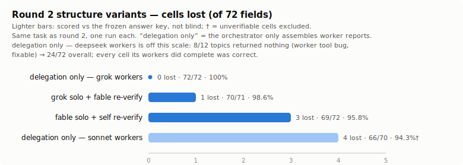

# Is grok delegation actually worth it? — the orchestration evals

Two rounds of controlled experiments on real web-research tasks, testing whether **fable
orchestrating grok workers** actually beats the alternatives. The lineup: the same structure
with other workers (fable + sonnet workers, fable + deepseek workers), three solo runs
(fable solo, sonnet solo, grok solo), a variant that gives sonnet a stronger-model
consultation tool, advisor(fable) — and a structure-variants follow-up that separates
*delegating to workers* from *the orchestrator re-verifying their numbers*.

Raw artifacts (prompts, harnesses, per-run `run.json`, worker outputs, blind copies, judge
scoreboards) are kept outside this repo in a private experiment workspace. This page uses
configuration names throughout and transcribes every number, so the results are readable
without the raw data.

## TL;DR

**Verdict: yes.** fable + grok workers beat every alternative tested — a perfect score on
both tasks (142/142 cells). And in a follow-up on the harder task, the same setup **stayed
perfect with the orchestrator's re-verification pass removed entirely**, at the lowest
Claude-side spend of any run ($2.97 API-equivalent, no web usage on the Claude meter at all)
and the fastest wall-clock. Recommended default: fable orchestrator + one grok worker per
topic, re-verification optional. Keep re-verification only when your workers are less
reliable than grok's (see the variants table below).

| Configuration | Round 1 (lookup task) | Round 2 (judgment-trap task) |
| --- | --- | --- |
| **fable + grok workers** | **70/70 (100%)** — 7/12 first-wave silent no-collection, all recovered by retry (0 final worker failures) | **72/72 (100%)** — fastest (12 min); 3/12 final worker failures, collected by the orchestrator itself |
| **fable + deepseek workers** | **70/70 (100%)** — 0 worker failures; slowest (22 min) | **71/71 (100%)**† — 5/12 final worker failures, collected by the orchestrator itself |
| fable + sonnet workers | 69/70 (98.6%) — 0 worker failures; fastest (6 min), heaviest Claude spend | not run with re-verification (without it: variants table below) |
| sonnet solo | 68/70 (97.1%)\* | 70.3/72 (97.7%) — average of 3 runs\* |
| fable solo | 69/70 (98.6%) | **68/72 (94.4%) — last**; hit both release-timing traps |
| grok solo | 66/67 (98.5%)† — facts all correct, citations weak | 67/71 (94.4%)† — **hit the exact same traps as fable solo** |

† run after the main experiment, scored against the frozen answer key (unverifiable cells
excluded from the denominator).
\* the round-1 sonnet run and round-2 runs 2–3 carried an advisor(fable) tool that fired 0
times — effectively solo runs, so all tables and charts group them under sonnet solo.

Two things about the advisor(fable) experiment. First, the advisor plumbing itself was
verified with forced probe calls before the runs — zero firings means the model chose not to
consult, not that the wiring was broken. Second, the two round-2 advisor runs differ by
exactly one prompt line (a hint that consulting the advisor is allowed), and the advisor
stayed silent even with the hint — so the treatment never arrived, those runs are repeats of
sonnet solo, and score gaps between them are run-to-run spread. By the same logic, the three
round-2 sonnet runs (72/72, 70/72, 69/72) landing at 95.8–100% is our estimate of sonnet's
run-to-run variance; tables and charts show their average (70.3/72).

### Which ingredient does the work?

The main runs could not tell whether the perfect scores came from *delegating* or from the
orchestrator's *re-verification pass* — the two always ran together. A follow-up on the same
round-2 task separated them:

| Variant (one run each) | Score | Verdict |
| --- | --- | --- |
| **delegation only — grok workers** (re-verification removed) | **72/72** | **Recommended default.** Same perfect score, lowest Claude spend of any run ($2.97), 9.5 min |
| grok solo collects → fable re-verifies | 70/71 | Verification alone doesn't reach it |
| fable solo + self-re-verify workflow | 69/72 | Self-verification adds little (+1 over plain fable solo) |
| delegation only — sonnet workers | 66/70 | A wrong index choice sailed through uncaught — not worth it as workers |
| delegation only — deepseek workers | 24/72 | 8/12 workers returned nothing (tool bug, fixable worker-side); **every completed cell correct** |

So the load-bearing parts are **one narrow topic per worker, forced to fetch real pages**
(the wrapper's web-collection gate) — not the re-verification pass. Two model families
failed the same trap cells when run solo over all 12 topics; the same class of model used as
one-topic workers didn't. Re-verification is insurance for less reliable workers: without it,
deepseek's tool failures leave topics unanswered and a sonnet worker's judgment slip goes
straight into the result.

Two readings to keep in mind. The main-table worker scores include a pre-declared fallback
("if a worker fails after its retry, the orchestrator collects that topic itself"), which
fired for 3/12 grok and 5/12 deepseek topics in round 2 — those scores measure the whole
procedure; worker quality shows up in the failure rates and the cost section. And grok's
worker failures are *silent no-collection*: clean exits with plausible reports written from
model memory, zero web calls — invisible except in the wrapper's tool-call trailer. A retry
that demands real fetches recovered them, and the wrapper now fails such runs automatically
(the web-collection gate — see the lessons section).

## The tasks

- **Round 1 — lookup.** Current monetary-policy settings of 12 central banks, 6 fields each
  (instrument name, value, last-change date, magnitude/direction, next meeting, verbatim
  decision-statement quote + URL). Official sources only. 12 × 6 = 72 possible cells, but
  the Singapore (MAS) website was down for maintenance throughout, so 2 of its cells could
  not be scored — every round-1 score is out of 70. Every configuration scored 94–100%
  — the task was easy enough that everyone bunched up near the ceiling, so it could not
  discriminate; only the citation field separated configurations.
- **Round 2 — judgment traps.** Real policy rate of 12 currency areas: policy rate (central
  bank) − latest YoY of the index the bank **officially targets** (national statistics
  office), computed to two decimals. Traps planted per field:
  - **Index choice**: countries where the official target index differs from the commonly
    quoted one (US targets PCE not CPI, Sweden CPIF, Norway CPI vs CPI-ATE, Japan all-items
    vs ex-fresh-food).
  - **Release timing**: inflation statistics come out as a preliminary (flash) figure first
    and are finalized later. Does the run respect a label the source itself marks
    "preliminary", and does it catch a release published just days before the run?
  - **Source attribution**: the primary source for a price index is the statistics office,
    not the central bank.
  - **Cascade scoring**: a wrong index choice also costs the arithmetic cell computed from
    it.

  12 × 6 = 72 cells, 1 point each.

> A "trap" here is a deliberately-planted easy-to-get-wrong spot — the point is not what the
> model knows but whether it actually slips where slipping is easy.

## Controls that made the numbers trustworthy

- **Blind judging.** The 5 main-run reports were shuffled to `A…E` and scored by a fable
  judge that never saw the mapping; result files were required to contain zero methodology
  traces (anything hinting which configuration produced them), verified by scan. The judge
  session's file access was audited post-run from its transcript: it read exactly
  `blind/*.md` and nothing else.
- **Identical prompts.** Paired configurations shared the same prompt file; the two
  advisor(fable) runs differ by exactly one documented line, byte-identical otherwise
  (`diff` kept).
- **Same-day completion + answer-drift control.** All runs and the judge finished the same
  day. A statistics release landing between run and scoring would change the correct answer
  itself, so release calendars were checked beforehand and a both-accepted rule was fixed in
  advance (never actually needed).
- **Predictions written down first.** Expectations — which configuration would win, whether
  the advisor(fable) would fire on its own — were written to a file before execution and
  compared against the results afterwards. This guards against fitting the interpretation to
  the outcome. Worker-failure handling (one retry, then orchestrator collects directly) was
  also pre-declared in the harness prompts.
- **Raw per-model token reporting.** Tokens are reported per model (fable / sonnet / haiku /
  grok / deepseek) as raw values; models with different prices are never summed into one
  number. (haiku-4.5 is not a tested configuration — it is the model Claude Code's WebSearch
  uses automatically to summarize fetched pages, so it shows up in every Claude-side run.)
  Claude-side figures come from `run.json` model-usage data; grok's own spend from the
  wrapper's `[grok-usage]` trailer (ctxTokens, wall seconds, tool calls per worker). The
  wrapper is this repo's `scripts/grok-run.sh`, the launch script every grok run here goes
  through: the grok CLI reports no usage on its own, so the wrapper appends this trailer
  after each session, and it also enforces the run-mode guardrails (tool allowlists, the
  web-collection gate described below).
- **Tool discipline.** All configurations: no skills, no MCP; subagents only where they
  *are* the configuration's worker channel (the sonnet-worker configuration spawns its
  workers via the Agent tool; grok and deepseek workers run through their external CLIs),
  never as an extra helper on top; web = WebSearch/WebFetch only (or grok's
  `web_search`/`web_fetch`); no curl; bot-blocked sites
  (403) handled by domain-limited search, never circumvention.

## Tokens and potential cost (raw per model)

### Round 1

| Configuration | Model | in | out | cache write | cache read |
| --- | --- | ---: | ---: | ---: | ---: |
| fable + grok workers | fable-5 | 3,122 | 33,143 | 126,729 | 1,338,989 |
| | haiku-4.5 | 468,310 | 3,277 | 0 | 0 |
| | grok-4.5 (19 worker sessions) — ctxTokens 621,232³ | — | — | — | — |
| fable + deepseek workers | fable-5 | 4,177 | 65,839 | 172,117 | 2,330,266 |
| | haiku-4.5 | 1,627,817 | 16,670 | 0 | 0 |
| | deepseek-v4-flash (232 requests) | 8,522,834¹ | 98,589² | — | — |
| fable + sonnet workers | fable-5 | 12,744 | 40,288 | 317,287 | 1,441,907 |
| | sonnet-5 | 112,811 | 88,806 | 455,805 | 3,867,924 |
| | haiku-4.5 | 3,761,819 | 38,063 | 0 | 0 |
| sonnet solo | sonnet-5 | 18,816 | 31,487 | 153,605 | 5,962,593 |
| | haiku-4.5 | 1,599,289 | 22,395 | 0 | 0 |
| fable solo | fable-5 | 8,330 | 49,839 | 133,803 | 1,939,729 |
| | haiku-4.5 | 1,361,978 | 14,115 | 0 | 0 |
| grok solo | grok-4.5 (1 session) — ctxTokens 141,786³ | — | — | — | — |

¹ includes 5,749,120 cached input — deepseek's meter counts cache hits *inside* its input
total, unlike Claude's separate cache columns, so it is a footnote here rather than a value
in those columns. ² includes 47,294 reasoning tokens. ³ the grok CLI
exposes no billable in/out split, only the session's final context size (ctxTokens) — a
separate meter, not summable with the other columns. haiku rows are the
WebSearch summarizer's automatic usage on the Claude side — a proxy for how much web
collection a run did.

| Configuration | Claude-side (measured, API-equivalent) | External wallet (estimate) |
| --- | ---: | :-- |
| fable + grok workers | $6.09 | grok $1.44–11.48 (API-equivalent bounds; actually run on a SuperGrok subscription) |
| fable + deepseek workers | $11.06 | deepseek ≈ $0.26 (measured from the OpenRouter activity CSV, cache credits included) |
| fable + sonnet workers | $19.03 | — |
| sonnet solo | $5.49 | — |
| fable solo | $8.84 | — |
| grok solo | $0 | grok $0.31–5.08 (retry session only — the first attempt died at the turn cap and left no token metering) |

### Round 2

| Configuration | Model | in | out | cache write | cache read |
| --- | --- | ---: | ---: | ---: | ---: |
| fable + grok workers | fable-5 | 5,490 | 41,540 | 139,750 | 2,051,132 |
| | haiku-4.5 | 532,540 | 6,558 | 0 | 0 |
| | grok-4.5 (16 worker sessions) — ctxTokens 615,004³ | — | — | — | — |
| fable + deepseek workers | fable-5 | 4,436 | 61,922 | 170,222 | 2,196,121 |
| | haiku-4.5 | 776,230 | 12,144 | 0 | 0 |
| | deepseek-v4-flash (19 runs) | 2,175,635¹ | 38,361² | — | — |
| sonnet solo (avg of 3 runs) | sonnet-5 | 19,799 | 40,191 | 176,709 | 7,067,494 |
| | haiku-4.5 | 1,454,400 | 26,202 | 0 | 0 |
| fable solo | fable-5 | 4,065 | 50,150 | 200,396 | 1,927,217 |
| | haiku-4.5 | 1,134,678 | 13,843 | 0 | 0 |
| grok solo | grok-4.5 (1 session) — ctxTokens 161,675³ | — | — | — | — |

¹ includes 913,792 cached input. ² includes 18,178 reasoning tokens. ³ same footnote as
the round-1 table.

| Configuration | Claude-side (measured, API-equivalent) | External wallet (estimate) |
| --- | ---: | :-- |
| fable + grok workers | $7.66 | grok $1.44–12.03 (API-equivalent bounds; actually run on a SuperGrok subscription) |
| fable + deepseek workers | $9.81 | deepseek ≈ $0.20 (OpenRouter rates, no cache discount) |
| sonnet solo (avg of 3 runs) | $5.99 | — |
| fable solo | $9.95 | — |
| grok solo | $0 | grok $0.35–5.79 (same method; single session) |

### Round 2 structure variants (cost)

| Variant | Claude-side (measured) | External wallet |
| --- | ---: | :-- |
| **delegation only — grok workers** | **$2.97** | grok ctxTokens 833k (21 sessions, incl. 9 gate-blocked cheap retries) |
| grok solo collects → fable re-verifies | $5.22 | grok ctxTokens 247k (1 session) |
| fable solo + self-re-verify | $8.13 | — |
| delegation only — deepseek workers | $6.83 | deepseek ≈ $0.20 (3.9M in, 2.1M of it cached / 57k out) |
| delegation only — sonnet workers | $11.54 | — |

The recommended variant's Claude-side detail: fable in 3,019 / out 18,420 / cache write
75,322 / cache read 511,531 — and **no haiku row at all**: the orchestrator ran with web
tools disabled, so every fetched page was on the external meter. That is why it undercuts
even sonnet solo. The deepseek variant's $6.83 is orchestrator turns spent wrangling worker
failures; the sonnet variant is the most expensive because the workers themselves bill the
Claude meter.

### Where each number comes from — and the grok caveat

- **Claude models**: `run.json` → `modelUsage`, per model, per run. First-party and exact.
  The cost column is `run.json total_cost_usd` — what the run would cost at API list prices;
  subscription users spend quota, not cash.
- **deepseek (via codex CLI)**: exact per-session `total_token_usage` (input / cached input /
  output / reasoning) is in the codex rollout logs at
  `$HOME/.codex/sessions/<YYYY>/<MM>/<DD>/rollout-*.jsonl` — sum the sessions in the run's
  time window. Cross-checkable against the OpenRouter activity CSV export (round 1 uses the
  CSV figures directly).
- **grok (via grok CLI)**: the CLI does **not** record billable in/out splits anywhere local.
  A session's files (`$HOME/.grok/sessions/<cwd-encoded>/<session-id>/`) expose only
  `signals.json → contextTokensUsed` (final context size — what the wrapper's trailer prints)
  and per-event running totals in `updates.jsonl`. The console Usage Explorer covers API-key
  billing only; these runs used a SuperGrok subscription, which is not itemized there. So
  grok in/out is *estimated*, bounded from session data:
  - lower bound ≈ final context × input price + estimated output (as if one fully-cached pass);
  - upper bound ≈ Σ(context size at each inference step, from the `updates.jsonl` token
    progression) × input price + estimated output (as if nothing was cached);
  - output tokens ≈ (assistant + reasoning + tool-call text length) / 4.
  All four figures in the tables (two rounds × workers/solo) were computed with one script,
  and session identification was validated by matching each run's trailer ctxTokens sum
  exactly. The range is wide because caching behavior is invisible to the client; the true
  figure sits between the bounds. A secondary real-world meter: the CLI's weekly-limit
  percentage (logged as `creditUsagePercent` in `$HOME/.grok/logs/unified.jsonl` every run)
  — round 2's grok-solo run moved it by about one percentage point of the weekly SuperGrok
  quota. On subscription, that phrasing is closer to reality than dollars.

Charts regenerate via `assets/gen_charts.py`.

## What the evals taught (and what changed in this repo because of them)

1. **The dangerous failure is silent no-collection, not crashes.** In round 2, 4 of 12 grok
   workers exited 0 with plausible, normal-sized output **written from model memory with zero
   web calls** — invisible in exit code, size, or text. The usage trailer's tool list was the
   only signal, and retries recovered only 1 of 4. (In round 1, 7 of 12 failed the same way;
   retries recovered all of them.) The wrapper now enforces this as the **web-collection
   gate**: a `research`/`research-rw` run with no web tool call exits non-zero
   (`FAILED: … no web tool call`). See `scripts/grok-run.sh`; regression-tested in
   `evals/stub-regression.sh` (H6).
2. **Solo runs of strong models miss mechanical diligence, not reasoning.** Round 2's
   decisive cells were "respect the source's own *preliminary* label" and "scan for a release
   published two days ago". Solo fable and solo grok both missed exactly these; every
   arithmetic error in the whole eval was zero. If the task has trap-shaped
   freshness/labeling cells, buy **narrow scope** — one topic per worker, forced to fetch
   real pages — before buying a bigger model (see #8).
3. **Splitting across workers also wins on turn budget.** A single grok session doing 12
   topics blew the default `--max-turns 30` and died mid-task (round 1 grok solo, first
   attempt); per-topic workers each used 3–17 tool calls and finished in about one worker's
   elapsed time. The wrapper now logs the *effective* turn cap, and SKILL.md documents the
   sizing rule.
4. **An idle advisor is not a safety net.** The advisor(fable) tool exposed to sonnet fired
   **0 times across 4 runs in both rounds** — including with a neutral one-line hint, and
   including on a cell where sonnet wrote down the correct official wording and then chose
   the wrong index anyway. The plumbing was verified live by forced probes, so non-firing was
   the model's choice. To make an advisor fire you must escalate the instruction to the point
   where you are measuring obedience, not judgment.
5. **Measurement can contaminate behavior.** Asking the child session to *report advisor
   availability* caused it to make a test call to the advisor (caught in smoke, fixed to
   "observe the tool list only"). Pre-write instrumentation wording and smoke-test it before
   the main runs.
6. **Where the money went.** Round 2, fable + grok workers: the orchestrator (fable) spent
   its tokens on verification and synthesis while 16 grok workers (12 + 4 retries) burned
   615k ctxTokens on xAI's meter; this configuration also had the *lowest* Claude-side
   haiku/web usage of all because collection was pushed off-quota. Delegation moved the
   heavy, parallelizable part of the task onto the separate wallet without costing accuracy —
   that, plus finding #2, is the case for this skill.
7. **Worker quality is a cost knob, not an accuracy knob.** Both worker configurations
   pre-declared the same fallback — "if a worker fails after its retry, the orchestrator
   collects that topic itself" — and in round 2 it fired for 3/12 currency areas with grok
   and 5/12 with deepseek. Accuracy was 100% either way, but the bills diverged: the deepseek
   configuration cost $9.81 Claude-side (+28% vs $7.66 for grok workers) with the highest
   fable output tokens of any configuration. The structure absorbs worker failure by spending
   orchestrator effort; a better worker keeps more of the work on the cheap meter. Pick
   workers by failure rate × external price, not by benchmark IQ — and since the score alone
   hides this difference, always report the failure rate next to the score (as the TL;DR
   table does).
8. **Re-verification is worker insurance — with grok workers you can skip it.** The
   structure-variants follow-up (TL;DR) removed the re-verification pass entirely: grok
   workers still 72/72 at $2.97; sonnet workers let one wrong index choice through (66/70);
   deepseek workers left 8/12 topics unanswered (24/72 — though every completed cell was
   correct, 31/31 cumulative across rounds). Two consequences. Worker *completion* is a
   channel/tooling problem to fix at the worker layer — for deepseek via codex that means
   `--disable multi_agent` against OpenRouter (its multi-agent tool schema 400s there),
   guards against its markup-breakdown failure mode, and a bigger retry budget — not
   something to paper over with orchestrator effort. And the metric that actually compares
   worker models is **completed-work accuracy** (grok 72/72, deepseek 31/31, sonnet the only
   one to complete a cell wrongly). One more note for the next round: the traps now catch
   almost nobody — this task's discriminative power is spent, so a rematch needs harder
   judgment-layer traps.

## Reusing the frame for the next model / channel

To compare a new delegate (a different CLI, a different model family, a new mode) against
these numbers, keep the frame and swap the configuration:

1. **Pick the task shape by what you want to discriminate.** Plain lookup tasks cannot
   discriminate — every model bunches up near a perfect score (round 1). If you want spread,
   plant judgment traps (official-vs-commonly-quoted definitions, release timing, source
   attribution, cascades). Re-check the trap answers on execution day — they shift with
   release calendars.
2. **Always run three reference configurations**: the candidate structure (orchestrator +
   delegate workers), the orchestrator model solo, and the delegate model solo. The finding
   is *structure beats both solos*; candidate-vs-one-solo confounds model and procedure.
3. **Blind-shuffle results before judging; ban methodology traces in result files; audit the
   judge's file access afterwards.** The judge verifies against primary sources, verbatim,
   and may not resolve a cell from background knowledge.
4. **Report tokens per model, raw, from each channel's first-party metering** — never sum
   across models. For an external delegate, capture its own meter (this repo's wrapper prints
   the `[grok-usage]` trailer for exactly this reason).
5. **Gate worker outputs on collection evidence (tool-call counts / tool lists), not exit
   codes.** Pre-declare the retry budget and the fallback after it (whether the orchestrator
   may collect directly) in the harness, and **always report how often the fallback fired
   next to the score** — the score alone cannot distinguish a configuration whose workers did
   the work from one whose orchestrator filled the gaps.
6. **Fix the run order cheapest-first, complete all configurations plus judging in one day,
   and log CLI and model versions** (these runs: claude CLI 2.1.206, grok 0.2.93, grok-4.5,
   claude-sonnet-5 / claude-fable-5).

## Open caveats and follow-ups

- **n=1 per configuration.** The three round-2 sonnet runs spread across 3 cells
  (95.8–100%), so single-run ties at the top (sonnet solo vs fable + grok workers) are inside
  noise. What survives n=1 is the *streak* (grok workers at 142/142 across two rounds and two
  task shapes) and the *matched failure fingerprints* of the solo runs.
- **The frozen-key configurations (round-2 grok solo and fable + deepseek workers) were
  scored against the frozen key, not blind** — comparable in method to each other,
  directionally comparable to the blind-judged main runs. Round 1's deepseek-worker
  configuration was a full blind participant.
- **The structure variants are one run each**, and only the first three were blind-judged
  (the sonnet- and deepseek-worker variants were scored against the frozen key).
- **Follow-up candidates.** ① Re-run fable + sonnet workers (with re-verification) on a
  judgment-trap task: it was the only worker configuration whose verification pass let an
  error through in round 1 — and without re-verification its workers let a trap through
  again, so the verification layer is doing real work in that configuration. ② A
  haiku-worker configuration would add one more data point to "pick workers by failure rate
  × external price". ③ ~~Decompose the structure~~ — done; see the variants table in the
  TL;DR and lesson #8. ④ Fix the deepseek worker channel (`--disable multi_agent`,
  markup-breakdown guard, bigger retry budget) and re-measure its completion rate — its
  completed-work accuracy is already flawless and its price is 1–2% of sonnet's. ⑤ Any
  rematch needs a harder task — these traps no longer separate configurations.
- **grok 0.2.93's `research` mode fails closed** (upstream bug combining web tools with the
  read-only allowlist), so the eval workers ran `research-rw` with the user's explicit OK.
  When xAI ships the fix, the same frame can compare `research` (read-only) workers directly.
