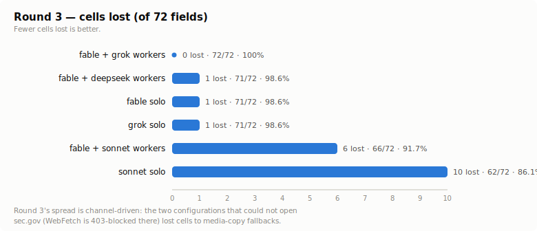
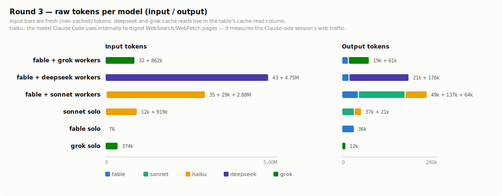
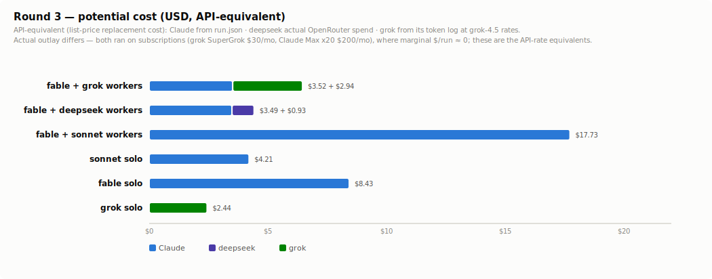

# Is grok delegation actually worth it? — the orchestration evals

Three rounds of controlled experiments on real web-research tasks, testing whether **fable
orchestrating grok workers** actually beats the alternatives. The lineup: the same structure
with other workers (fable + sonnet workers, fable + deepseek workers) and three solo runs
(fable solo, sonnet solo, grok solo).

Raw artifacts (prompts, harnesses, per-run `run.json`, worker outputs, blind copies, judge
scoreboards) are kept outside this repo in a private experiment workspace. This page uses
configuration names throughout and transcribes every number, so the results are readable
without the raw data.

## TL;DR

**Verdict: yes.** fable + one grok worker per topic beat every alternative tested — a
perfect score on all three task shapes (72/72 lookup, 72/72 judgment traps, 72/72
source-diligence), at or near the lowest Claude-side spend of each round ($2.69 / $2.97 /
$3.52 API-equivalent, no web usage on the Claude meter at all). In this configuration the
orchestrator only
splits the task and assembles what workers report — no re-verification pass; a variant
that adds one scored the same with grok workers and only multiplied the Claude bill
(raw runs in the workspace, summary in lesson #8).

| Configuration | Round 1 (lookup) | Round 2 (judgment traps) | Round 3 (source diligence) |
| --- | --- | --- | --- |
| **fable + grok workers** | **72/72 (100%)** — 12/12 workers on the first wave, zero retries | **72/72 (100%)** — 12/12 workers | **72/72 (100%)** — flawless three rounds running |
| fable + deepseek workers | 71/72 (98.6%) — 12/12 workers completed; the only loss was writing the effective date as the Fed's decision date | **72/72 (100%)** — 12/12 workers completed | 71/72 (98.6%) — one guidance tax-rate misread |
| fable + sonnet workers | **72/72 (100%)** — 12/12 workers | 69/72 (95.8%) — a wrong index choice passed through uncaught (3-cell cascade) | 66/72 (91.7%) — workers couldn't open sec.gov originals, fell back to media copies (1 stale figure + 4 quote mismatches + 1 arithmetic) |
| sonnet solo | 70/72 (97.2%) | 69.3/72 (96.3%) — average of 3 runs (70·69·69) | 62/72 (86.1%) — same 403, retreated to media excerpts and filename guessing; stale figure, quote and guidance cascade |
| fable solo | 71/72 (98.6%) | 68/72 (94.4%); hit both release-timing traps | 71/72 (98.6%) — diagnosed the 403 and switched to the task-permitted identified-UA requests for SEC |
| grok solo | **72/72 (100%)** | 67/72 (93.1%) — hit the exact same traps as fable solo | 71/72 (98.6%) — wrote the release date as the filing date on one cell |

*A variant where the orchestrator re-verifies and corrects every worker result was
also run, but the goal here is testing grok delegation, not workflows, so it is excluded —
same perfect grok-worker scores at 2–3× the Claude-side cost. Raw runs in the experiment
workspace.*

### Why deepseek is in the mix

I had already been delegating research to deepseek in day-to-day use — calling the codex
CLI from Claude Code is already a widely-used pattern, so swapping just the model to
deepseek keeps the familiar path and only trades in deepseek's far lower rate, which
mattered more given I don't keep a ChatGPT subscription. Since this was already how I
delegated, I put it in the comparison to see how the way I actually work stacks up against
grok delegation.

## The tasks

- **Round 1 — lookup.** Current monetary-policy settings of 12 central banks, 6 fields each
  (instrument name, value, last-change date, magnitude/direction, next meeting, verbatim
  decision-statement quote + URL). Official sources only. 12 × 6 = 72 cells. The Singapore
  (MAS) website was down for maintenance throughout, but domain-limited search still let
  every cell be scored. Every configuration scored 97–100% — the task was
  easy enough that everyone bunched up near the ceiling, so it could not discriminate; only
  one detail slip and the citation field separated configurations.
- **Round 2 — judgment traps.** Real policy rate of 12 currency areas: policy rate (central
  bank) − latest YoY of the index the bank **officially targets** (national statistics
  office), computed to two decimals. Traps planted per field:
  - **Index choice**: countries where the official target index differs from the commonly
    quoted one (US targets PCE not CPI, Sweden CPIF, Norway CPI vs CPI-ATE, Japan all-items
    vs ex-fresh-food).
  - **Release timing**: inflation statistics come out as a preliminary (flash) figure first
    and are finalized later. Does the run respect a label the source itself marks
    "preliminary", and does it catch a release published just days before the run?
  - **Source attribution**: the primary source for a price index is the statistics office,
    not the central bank.
  - **Cascade scoring**: a wrong index choice also costs the arithmetic cell computed from
    it.

  12 × 6 = 72 cells, 1 point each.
- **Round 3 — source diligence.** Earnings 8-K filings of 12 companies (airline, beverages,
  apparel, consumer, industrials, …) filed with SEC EDGAR after 2026-07-06, 6 fields each
  (filing date + accession number, fiscal-quarter label + period end, GAAP diluted EPS,
  revenue + computed YoY %, guidance presence/metrics/GAAP basis, verbatim quote of the GAAP
  EPS sentence + EDGAR URL). Primary source is EDGAR by rule (company IR for corroboration
  only, third-party summaries and news banned), and the accession numbers were *not* given —
  finding the right filing via full-text search is part of the task. Traps:
  - **Corrected filing**: one company's target filing is an amended 8-K (8-K/A) whose GAAP
    EPS differs from the superseded original ($(0.98) → $(1.15)) — using the stale original,
    or a summary based on it, shows up in the value.
  - **GAAP/adjusted side-by-side**: every release prints adjusted EPS next to GAAP.
  - **Fiscal-year labels**: quarters ending late May that are "Q1 FY2027" for some companies,
    a 5/30 (not 5/31) period end, etc.
  - **Metadata precision**: a company whose press-release date differs from the EDGAR filing
    date.
  - **Verbatim-quote field**: the exact original sentence, letter for letter — a detector for
    whether the run actually opened the source or patched over it with copies and summaries.

  12 × 6 = 72 cells. One special condition: the SEC *requires* automated access to identify
  itself with a contact User-Agent, so the task explicitly permitted identified-UA direct
  requests for SEC domains only (compliance, not spoofing — the ban on UA spoofing and
  block circumvention elsewhere stayed as before).

> A "trap" here is a deliberately-planted easy-to-get-wrong spot — the point is not what the
> model knows but whether it actually slips where slipping is easy.

## Tokens and potential cost (raw per model)

### Round 1

**Raw tokens per model**

| Configuration | Model | sessions¹ | in | out | cache write | cache read |
| --- | --- | ---: | ---: | ---: | ---: | ---: |
| fable + grok workers | fable-5 | 1 | 3,025 | 16,184 | 73,594 | 375,824 |
| | grok-4.5² | 12 | 834,126 | 35,889 | — | 1,715,968 |
| fable + deepseek workers | fable-5 | 1 | 3,176 | 18,750 | 68,874 | 760,200 |
| | deepseek-v4-flash | 15 | 7,566,286³ | 187,377⁴ | — | 11,094,784³ |
| fable + sonnet workers | fable-5 | 1 | 10,123 | 24,916 | 89,685 | 787,448 |
| | sonnet-5 | 12 | 116,460 | 52,193 | 409,152 | 2,567,989 |
| | haiku-4.5⁵ | — | 2,895,427 | 30,475 | 0 | 0 |
| sonnet solo | sonnet-5 | 1 | 18,816 | 31,487 | 153,605 | 5,962,593 |
| | haiku-4.5 | — | 1,599,289 | 22,395 | 0 | 0 |
| fable solo | fable-5 | 1 | 8,330 | 49,839 | 133,803 | 1,939,729 |
| | haiku-4.5 | — | 1,361,978 | 14,115 | 0 | 0 |
| grok solo | grok-4.5 | 1 | 200,350 | 11,402 | — | 636,416 |

¹ sessions = actual invocations (retries included). deepseek 15 = 12 first-wave + 3 retries. 
² grok's in (fresh) / out / cache read are summed from its own per-turn log (unified.jsonl) — grok, like deepseek, reports no cache write (hence —), and out includes reasoning tokens (e.g. 11,731 for the R1 workers). Session-matching was cross-checked against each session's final context size (ctxTokens, the wrapper's signals.json). 
³ deepseek's meter reports cache hits only as cache read (folded *inside* its original input total of 18,661,070) and reports no cache write (creation) — to match Claude's columns, the 11,094,784 cache hits are moved to the cache-read column and `in` keeps only the 7,566,286 fresh input. The input is large because deepseek workers collect via shell fetches, reading raw page sources whole. 
⁴ of the 187,377 output, 72,599 are reasoning tokens — deepseek and grok break reasoning out (grok's is footnote ²); only Claude (run.json) does not meter reasoning separately, so its reasoning is folded into output (this does not mean Claude reasoned less — its meter just doesn't surface it). 
⁵ haiku is not run by the eval — it is the model Claude Code's WebSearch/WebFetch tooling uses internally to digest fetched pages, so its row measures the *Claude-side session's* web traffic (an internal model running inside the active Claude session, not a spawned session, so its sessions cell is —). The grok- and deepseek-worker orchestrators ran with web tools disabled, so haiku is zero there (rows omitted); the sonnet-worker haiku row is the *workers'* web traffic (they run inside the same Claude session).

---

**Potential cost per configuration**

All figures are **API-equivalent** (replacement cost). Claude from run.json, deepseek from actual OpenRouter spend, grok computed from its own token log at grok-4.5 rates (method in the sources section below).

| Configuration | Claude-side | External (API-equiv) | Total |
| --- | ---: | ---: | ---: |
| fable + grok workers | $2.69 | grok $2.74 | $5.43 |
| fable + deepseek workers | $3.11 | deepseek $1.71 | $4.82 |
| fable + sonnet workers | $11.05 | — | $11.05 |
| sonnet solo | $5.49 | — | $5.49 |
| fable solo | $8.84 | — | $8.84 |
| grok solo | $0 | grok $0.79 | $0.79 |

### Round 2

**Raw tokens per model**

| Configuration | Model | sessions¹ | in | out | cache write | cache read |
| --- | --- | ---: | ---: | ---: | ---: | ---: |
| fable + grok workers | fable-5 | 1 | 3,019 | 18,420 | 75,322 | 511,531 |
| | grok-4.5² | 21 | 1,281,831 | 60,100 | — | 2,871,296 |
| fable + deepseek workers | fable-5 | 1 | 3,180 | 18,638 | 60,639 | 1,092,470 |
| | deepseek-v4-flash | 15 | 13,675,649³ | 259,998⁴ | — | 14,725,376³ |
| fable + sonnet workers | fable-5 | 1 | 16,804 | 30,695 | 98,534 | 707,014 |
| | sonnet-5 | 12 | 109,007 | 62,005 | 422,890 | 3,642,666 |
| | haiku-4.5⁵ | — | 2,363,450 | 34,213 | 0 | 0 |
| sonnet solo (avg of 3 runs) | sonnet-5 | 1 | 19,799 | 40,191 | 176,709 | 7,067,494 |
| | haiku-4.5 | — | 1,454,400 | 26,202 | 0 | 0 |
| fable solo | fable-5 | 1 | 4,065 | 50,150 | 200,396 | 1,927,217 |
| | haiku-4.5 | — | 1,134,678 | 13,843 | 0 | 0 |
| grok solo | grok-4.5 | 1 | 248,095 | 11,056 | — | 1,071,232 |

¹ same as the round-1 table. deepseek 15 = 12 first-wave + 3 retries. 
² same as the round-1 table. grok sessions = grok-4.5's session count (21 = 12 first-wave + 9 retries). 
³ of the original 28,401,025 input total, 14,725,376 cache hits are split out to the cache-read column (deepseek folds cache hits into input and reports no cache write), leaving 13,675,649 fresh input in `in` — same handling as round-1 footnote ³. 
⁴ of the 259,998 output, some are reasoning tokens — same as round-1 footnote ⁴ (deepseek and grok break reasoning out). 
⁵ same as the round-1 table.

---

**Potential cost per configuration**

| Configuration | Claude-side | External (API-equiv) | Total |
| --- | ---: | ---: | ---: |
| fable + grok workers | $2.97 | grok $4.36 | $7.33 |
| fable + deepseek workers | $3.27 | deepseek $2.60 | $5.87 |
| fable + sonnet workers | $11.54 | — | $11.54 |
| sonnet solo (avg of 3 runs) | $5.99 | — | $5.99 |
| fable solo | $9.95 | — | $9.95 |
| grok solo | $0 | grok $1.10 | $1.10 |

### Round 3

**Raw tokens per model**

| Configuration | Model | sessions¹ | in | out | cache write | cache read |
| --- | --- | ---: | ---: | ---: | ---: | ---: |
| fable + grok workers | fable-5 | 1 | 32 | 19,363 | 92,882 | 696,005 |
| | grok-4.5² | 14 | 862,185 | 61,041 | — | 1,702,016 |
| fable + deepseek workers | fable-5 | 1 | 43 | 20,992 | 75,536 | 928,585 |
| | deepseek-v4-flash | 13 | 4,747,194³ | 175,585⁴ | — | 5,210,240³ |
| fable + sonnet workers | fable-5 | 1 | 35 | 48,598 | 129,150 | 1,385,285 |
| | sonnet-5 | 14 | 29,118 | 136,889 | 559,754 | 6,487,692 |
| | haiku-4.5⁵ | — | 2,881,925 | 64,181 | 0 | 0 |
| sonnet solo | sonnet-5 | 1 | 11,571 | 36,529 | 138,136 | 4,038,827 |
| | haiku-4.5 | — | 918,774 | 21,088 | 0 | 0 |
| fable solo⁶ | fable-5 | 1 | 76 | 36,444 | 161,236 | 3,377,666 |
| grok solo | grok-4.5 | 1 | 373,565 | 11,716 | — | 3,235,968 |

¹ same as the round-1 table. grok 14 = 12 first-wave + 2 retries, deepseek 13 = 12 first-wave + 1 supplemental (the orchestrator's launcher script dropped one company; its aggregation pass caught the gap and dispatched a make-up worker), sonnet workers 14 = 12 first-wave + 2 respawns (workers self-reported an unobtained quote). 
² same as the round-1 table. Session matching reconciled 14/14. 
³ of the original 9,957,434 input total, 5,210,240 cache hits are split out to the cache-read column — same handling as round-1 footnote ³. 
⁴ of the 175,585 output, 79,528 are reasoning tokens — same as round-1 footnote ⁴. 
⁵ same as the round-1 table. 
⁶ fable solo ended up using no Claude web tools this round (haiku 0, zero WebSearch calls) — WebFetch is 403-blocked SEC-wide, and after diagnosing that it switched to the task-permitted identified-UA direct requests for SEC domains, parsing the raw exhibits locally.

---

**Potential cost per configuration**

| Configuration | Claude-side | External (API-equiv) | Total |
| --- | ---: | ---: | ---: |
| fable + grok workers | $3.52 | grok $2.94 | $6.46 |
| fable + deepseek workers | $3.49 | deepseek $0.93 | $4.42 |
| fable + sonnet workers | $17.73 | — | $17.73 |
| sonnet solo | $4.21 | — | $4.21 |
| fable solo | $8.43 | — | $8.43 |
| grok solo | $0 | grok $2.44 | $2.44 |

Cost shape on the API basis: the sonnet-worker configuration is the most expensive every
round ($11.05–17.73) because its workers bill the Claude meter. grok/deepseek worker
delegation moves the heavy web collection onto a cheaper external meter, coming in below
fable solo ($4.42–7.33) and around sonnet solo. grok solo is the cheapest ($0.79–2.44).

**But actual outlay differs.** grok here ran on a SuperGrok subscription ($30/mo) and Claude
on Max x20 ($200/mo); under a subscription the marginal dollar cost per run is ≈$0 (you burn
quota, not cash). grok's subscription is far cheaper than its API-equivalent — round-1
workers cost ≈$0.35 of quota vs $2.74 at API rates, about 8× — so the API bars actually
*understate* grok delegation's real-world advantage. The skill's premise ("push heavy
collection to grok to spare the Claude quota") holds on the API basis and is stronger on the
subscription basis.

**Per-worker latency (aside).** Measured time per worker: grok workers ran a median 30–45s
(the trailer's wallSec), deepseek workers several times that with a wide spread (round-1
median 82s, up to about 8 min, from the codex rollout timestamps) — the same cause as their
large input above, since they shell-fetch and read whole page sources, stretching the
session. Per-configuration wall-clock is not used as a comparison metric here: the runs were
interactive (a human approving tool calls) and worker parallelization differed by
configuration.

### Where each number comes from — and the grok caveat

- **Claude models**: `run.json` → `modelUsage`, per model, per run. First-party and exact.
  The cost column is `run.json total_cost_usd` — what the run would cost at API list prices;
  subscription users spend quota, not cash.
- **deepseek (via codex CLI)**: exact per-session `total_token_usage` (input / cached input /
  output / reasoning) is in the codex rollout logs at
  `$HOME/.codex/sessions/<YYYY>/<MM>/<DD>/rollout-*.jsonl` — sum the sessions in the run's
  time window. Cross-checkable against the OpenRouter activity CSV export (round 1 uses the
  CSV figures directly).
- **grok (via grok CLI)**: grok logs its real billable tokens per turn
  (`prompt_tokens` / `cached_prompt_tokens` / `completion_tokens`) to
  `$HOME/.grok/logs/unified.jsonl`. Each configuration's worker sessions are matched to that
  log by the `session=` prefix the wrapper trailer prints, summed, and priced at grok-4.5
  API rates ($2 / $0.50 cached / $6 per 1M) — the matched session counts reconcile with the
  token table, cross-checked against each session's final context size (ctxTokens; round-1
  workers 12 sessions / 735,055, round-2 21 sessions / 833,433, round-3 workers 14
  sessions). grok actually ran on a SuperGrok subscription ($30/mo), so no
  dollars were billed; the API-equivalent puts it on the same footing as the other models.
  It can also be read on the subscription basis: the CLI logs `creditUsagePercent`
  (1-point granularity) each run, and round 2's grok-solo run moved it exactly one point
  (SuperGrok $30/mo → ≈$6.9/week, so 1%p ≈ $0.07). That subscription figure is far below the
  API-equivalent — the flat-rate discount (see the subscription note above).

Charts regenerate via `assets/gen_charts.py`.

## Controls that made the numbers trustworthy

- **Unified judging.** Each round's reports were shuffled together and scored by a single
  fable judge session that never saw the mapping, against one shared answer key. Result
  files were verified by scan to contain zero methodology traces (anything hinting which
  configuration produced them), and the judge session's file access was audited post-run
  from its transcript: it read exactly the shuffled copies and the key. Round 1 happened to
  be judged by three independent sessions with different shuffles — their verdicts on the
  same reports matched cell for cell.
- **Identical prompts.** Paired configurations shared the same prompt file; the two
  advisor(fable) runs differ by exactly one documented line, byte-identical otherwise
  (`diff` kept).
- **sonnet solo = the average of 3 runs (69.3/72).** Two of the three carried advisor(fable),
  which never fired (see lesson #4), so all three are repeats of sonnet solo. Their spread
  (70/72, 69/72, 69/72) estimates sonnet's run-to-run variance. Advisor behavior is not this
  eval's question, so no further runs.
- **Narrow execution window + answer-drift control.** All round-1/2 runs sat inside
  2026-07-10–11, and release calendars plus the judging records confirm no answer-changing
  release or rate decision landed inside that window. A both-accepted rule for a release
  landing on an execution day was fixed in advance (never needed), and judging finished the
  same day for all configurations. Round 3 ran and was judged within one day (2026-07-12),
  and its targets are already-filed 8-Ks — immutable documents, so there is no drift to
  control; instead, all 12 companies were re-checked for freshly-filed amendments (8-K/A)
  right before execution.
- **Answer key written before the runs (round 3).** Round 3's answer table and adjudication
  rules (including how seven boundary cases would be scored, with expected wrong answers
  noted per company) were extracted from the source documents *before* any run, and kept out
  of every run-prompt path. That pre-built key turned out to be what made judging possible at
  all: the judge session itself was 403-blocked from sec.gov and settled every cell against
  the key plus official distribution copies of the releases (shared denominator 72, zero
  unscorable cells).
- **Predictions written down first.** Expectations — which configuration would win, whether
  the advisor(fable) would fire on its own — were written to a file before execution and
  compared afterwards, to guard against fitting the interpretation to the outcome.
  Worker-failure handling (one retry, then orchestrator collects directly) was also
  pre-declared in the harness prompts.
- **Raw per-model token reporting.** Tokens are reported per model (fable / sonnet / haiku /
  grok / deepseek) as raw values; models with different prices are never summed into one
  number. Sources: Claude-side from `run.json` model-usage data, grok-side from the wrapper
  (`scripts/grok-run.sh` — every grok run goes through it; it appends the usage trailer and
  enforces the run-mode guardrails) via its `[grok-usage]` trailer.
- **Tool discipline.** All configurations: no skills, no MCP; subagents only where they
  *are* the configuration's worker channel (the sonnet-worker configuration spawns its
  workers via the Agent tool; grok and deepseek workers run through their external CLIs),
  never as an extra helper on top; web = WebSearch/WebFetch only (or grok's
  `web_search`/`web_fetch`); no curl; bot-blocked sites
  (403) handled by domain-limited search, never circumvention. Round 3 carved out one
  exception: the SEC's policy requires an identifying User-Agent, so identified-UA direct
  requests were task-permitted for SEC domains only (see the task section) — the rules for
  every other site were unchanged.

## What the evals taught (and what changed in this repo because of them)

1. **The dangerous failure is silent no-collection, not crashes.** In round 2, 9 of 12
   first-wave grok workers exited 0 with plausible, normal-sized output **written from model
   memory with zero web calls** — invisible in exit code, size, or text; the usage trailer's
   tool list was the only signal. The wrapper's **web-collection gate** (a
   `research`/`research-rw` run with no web tool call exits non-zero — `FAILED: … no web
   tool call`) caught all 9, and a retry carrying a "real `web_fetch` for every claim"
   prompt line recovered all of them. In round 1 that line was in the worker prompts from
   the start and the gate never fired. See `scripts/grok-run.sh`; regression-tested in
   `evals/stub-regression.sh` (H6).
2. **Solo runs of strong models miss mechanical diligence, not reasoning.** Round 2's
   decisive cells were "respect the source's own *preliminary* label" and "scan for a release
   published two days ago". Solo fable and solo grok both missed exactly these; every
   arithmetic error in the whole eval was zero. If the task has trap-shaped
   freshness/labeling cells, buy **narrow scope** — one topic per worker, forced to fetch
   real pages — before buying a bigger model (see #8).
3. **Splitting across workers also wins on turn budget.** A single grok session doing 12
   topics blew the default `--max-turns 30` and died mid-task (round 1 grok solo, first
   attempt); per-topic workers each used 3–17 tool calls and finished in about one worker's
   elapsed time. The wrapper now logs the *effective* turn cap, and SKILL.md documents the
   sizing rule.
4. **An idle advisor is not a safety net.** The advisor(fable) tool exposed to sonnet fired
   **0 times across 4 runs in both rounds** — including with a neutral one-line hint, and
   including on a cell where sonnet wrote down the correct official wording and then chose
   the wrong index anyway. The plumbing was verified live by forced probes, so non-firing was
   the model's choice. To make an advisor fire you must escalate the instruction to the point
   where you are measuring obedience, not judgment.
5. **Measurement can contaminate behavior.** Asking the child session to *report advisor
   availability* caused it to make a test call to the advisor (caught in smoke, fixed to
   "observe the tool list only"). Pre-write instrumentation wording and smoke-test it before
   the main runs.
6. **Where the money went.** In the grok-worker configuration the orchestrator (fable)
   spent its tokens on splitting and assembly while the grok workers burned their ctxTokens
   on xAI's meter; with the orchestrator's web tools disabled its Claude-side haiku/web
   usage was exactly zero. Delegation moved the heavy, parallelizable part of the task onto
   the separate wallet without costing accuracy — that, plus finding #2, is the case for
   this skill.
7. **Fix worker completion at the channel layer; compare worker models on completed-work
   accuracy.** A worker that cannot finish is a channel/tooling problem to fix at the
   worker layer, not something to paper over with orchestrator effort — and fixing the
   deepseek channel proved it: a minimal `CODEX_HOME` (its default config's MCP/plugin
   tools serialize as a `namespace` tool type OpenRouter rejects with a 400), a
   collection gate, a bigger retry budget, and a final-message format rule took completion
   to 12/12 in all three rounds. The metric that actually compares worker
   *models* is **completed-work accuracy**: over rounds 1–2, grok 144/144, deepseek 143/144
   (the single loss wrote the effective date as the Fed's decision date), sonnet 141/144
   with all three losses on one judgment trap's cascade. Adding round 3 gives grok 216/216,
   deepseek 214/216, sonnet 207/216 — but sonnet's round-3 losses were largely channel
   design (see #9), so the two-round figures are the cleaner model comparison. Since the
   score alone cannot distinguish completion
   failure from judgment error, always report the failure rate next to the score (as the
   TL;DR table does).
8. **Re-verification is worker insurance — with grok workers you can skip it.** A variant
   where the orchestrator re-checks every worker number against the primary source (runs
   kept in the workspace) scored exactly the same as the main table with grok workers and
   cost 2–3× more Claude-side ($6.09–7.66 vs $2.69–2.97), because the re-checking runs on
   the Claude web meter. The only place the insurance actually paid out was sonnet
   workers on the judgment task, where the uninsured run let a wrong index choice through
   (69/72). The note at the end of round 2 was "a rematch needs harder judgment-layer
   traps" — round 3 was that rematch; see #9 for how it went.
9. **In round 3 the value traps again caught nobody — the real separator was "can this
   channel open the source at all".** The GAAP/adjusted pairs, fiscal-year labels and
   period-end traps were passed by all six configurations, and most lost cells (including
   the corrected-filing trap) traced to a single cause: Claude Code's WebFetch is
   403-blocked SEC-wide (it cannot attach an identifying User-Agent), so **the ability to
   open sec.gov originals differed by configuration.** grok CLI's `web_fetch` and
   deepseek's (codex) shell fetch went through; fable solo diagnosed the 403 and switched
   itself to the task-permitted identified-UA requests for SEC (71/72). sonnet solo, given
   the same toolset, did not switch — it retreated to media copies and filename guessing
   (62/72: stale pre-correction figure, four quote mismatches, invented guidance). The
   sonnet-worker configuration couldn't switch even in principle, since its harness blocks
   shell access (66/72) — read that loss as channel design, not model quality. Two lessons:
   (a) the verbatim-quote+URL field worked exactly as designed, as a cheap detector of
   "did the run actually open the source" — values can mostly be reconstructed from
   copies, verbatim quotes cannot; (b) if a task's primary source sits behind bot
   blocking, configurations separate on whether their collection channel can open that
   source *before* they separate on anything else — part of grok delegation's edge this
   round belongs to the channel (its own web_fetch), not the model.

## Reusing the frame for the next model / channel

To compare a new delegate (a different CLI, a different model family, a new mode), keep the
frame and swap the configuration. Most of it is just applying the principles above — blind
judging, raw per-model token reporting (no summing), gating workers on collection evidence
plus reporting fallback counts, running cheapest-first inside a narrow window and logging CLI
and model versions (rounds 1–2: claude CLI 2.1.206, round 3: 2.1.207; grok 0.2.93, grok-4.5,
claude-sonnet-5 / claude-fable-5). Two rules to add on top:

1. **Always run three reference configurations**: the candidate structure (orchestrator +
   delegate workers), the orchestrator model solo, and the delegate model solo. The finding
   is *structure beats both solos*; candidate-vs-one-solo confounds model and procedure.
2. **Pick the task shape by what you want to discriminate.** Plain lookup tasks bunch up near
   a perfect score and can't separate configurations (round 1). For spread, plant judgment
   traps — and re-check the trap answers on execution day, since they shift with release
   calendars.

## Open caveats and follow-ups

- **n=1 per configuration.** The three round-2 sonnet runs spread across 1 cell
  (70·69·69), so 1–2-cell gaps between configurations are inside noise. What survives n=1
  is the *streak* (grok workers at 216/216 across three task shapes) and the *matched
  failure fingerprints* — round 2's two solos failing the same traps the same way, round
  3's two sonnet configurations failing the same 403 the same way.
- **Round 1–2 scores are from a unified re-judging on 2026-07-11.** The original experiment
  scored each run differently (those records stay in the workspace); every report was then
  re-scored with one shared key and one procedure, removing the differences. A few
  configurations moved by 1–2 cells; the ranking and conclusions are unchanged. Round 3 was
  scored with that unified method (pre-built key + a single blind session) from the start.
  Evidence the scoring holds up: the few cells where different judge sessions split were all
  resolved against the primary source (the RBA meeting-calendar misread overturned against
  the official page; round 2's four split quote cells adjudicated by the pre-registered
  "passes if verbatim at its URL" rule, which also matches the original experiment's
  verdicts). A single judge session has its own error rate, so cross-run verdict comparison
  is a cheap error detector.
- **One round-3 judging limitation.** The judge session was itself 403-blocked from sec.gov,
  so it verified against the pre-built key plus official distribution copies of the
  releases. Only one verdict pair (a quote phrasing in two reports) rests on
  absence-from-copies rather than direct confirmation — flagged with a confidence grade in
  the scoreboard; every other cell was settled verbatim.
- **Follow-up candidates.** ① fable + sonnet workers plus a re-verification pass on a
  judgment-trap task: whether the verification layer catches the wrong index choice
  (69/72) is the test of sonnet workers' insurance case. ② A haiku-worker configuration
  would add one more data point to "pick workers by failure rate × external price".
  ③ Pure judgment discrimination is still unsolved — round 3's top four configurations
  bunched at 71–72 again, and the spread came from the access channel, not the traps. The
  next task needs sources that open without bot blocking and traps that live purely in the
  judgment layer to separate the top tier.
- **grok 0.2.93's `research` mode fails closed** (upstream bug combining web tools with the
  read-only allowlist), so the eval workers ran `research-rw` with the user's explicit OK.
  When xAI ships the fix, the same frame can compare `research` (read-only) workers directly.
