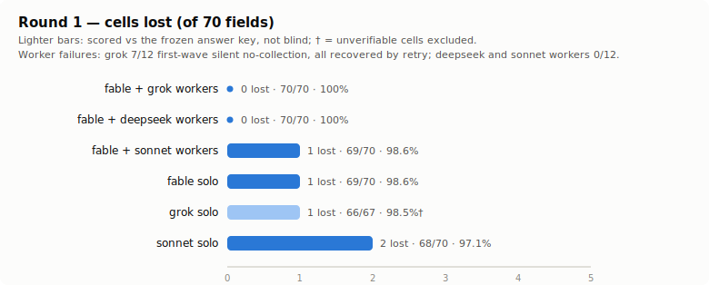
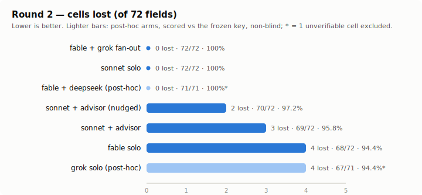
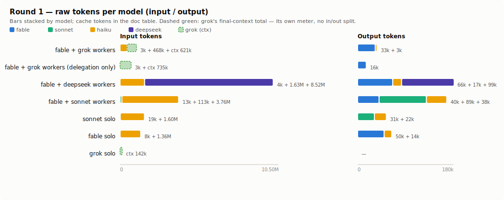
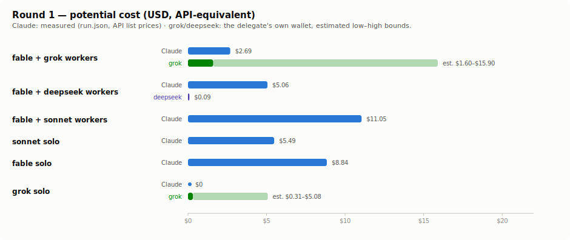
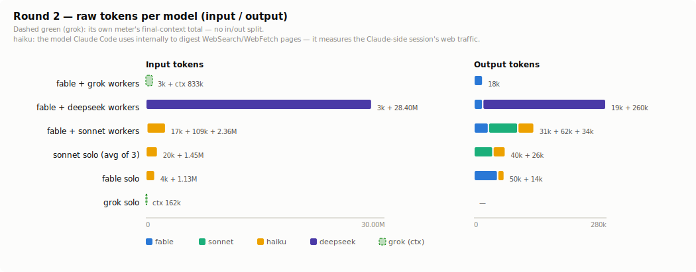
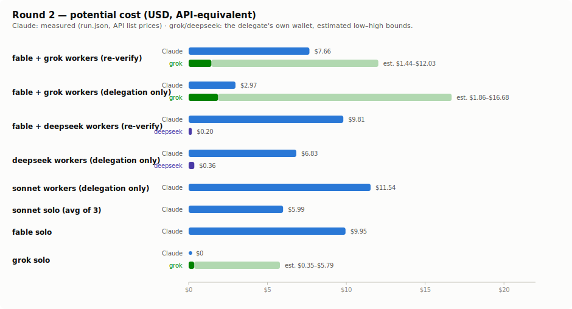

# Is grok delegation actually worth it? — the orchestration evals

Two rounds of controlled experiments on real web-research tasks, testing whether **fable
orchestrating grok workers** actually beats the alternatives. The lineup: the same structure
with other workers (fable + sonnet workers, fable + deepseek workers) and three solo runs
(fable solo, sonnet solo, grok solo).

Raw artifacts (prompts, harnesses, per-run `run.json`, worker outputs, blind copies, judge
scoreboards) are kept outside this repo in a private experiment workspace. This page uses
configuration names throughout and transcribes every number, so the results are readable
without the raw data.

## TL;DR

**Verdict: yes.** fable + one grok worker per topic beat every alternative tested — a
perfect score on both task shapes (72/72 lookup, 72/72 judgment traps), at the lowest
Claude-side spend of each round ($2.69 / $2.97 API-equivalent, no web usage on the Claude
meter at all) and the fastest wall-clock. In this configuration the orchestrator only
splits the task and assembles what workers report — no re-verification pass; a variant
that adds one scored the same with grok workers and only multiplied the Claude bill
(raw runs in the workspace, summary in lesson #8).

| Configuration | Round 1 (lookup task) | Round 2 (judgment-trap task) |
| --- | --- | --- |
| **fable + grok workers** | **72/72 (100%)** — 12/12 workers on the first wave, zero retries | **72/72 (100%)** — 12/12 workers |
| fable + deepseek workers | 71/72 (98.6%) — 12/12 workers completed; the only loss was writing the effective date as the Fed's decision date | **72/72 (100%)** — 12/12 workers completed |
| fable + sonnet workers | **72/72 (100%)** — 12/12 workers | 69/72 (95.8%) — a wrong index choice passed through uncaught (3-cell cascade) |
| sonnet solo | 70/72 (97.2%) | 69.3/72 (96.3%) — average of 3 runs (70·69·69) |
| fable solo | 71/72 (98.6%) | 68/72 (94.4%); hit both release-timing traps |
| grok solo | **72/72 (100%)** | 67/72 (93.1%) — hit the exact same traps as fable solo |

Scoring was one unified procedure per round — a single judge session that did not know
which report came from which configuration (blind), against one shared answer key;
unanswered cells score zero and the denominator is 72 for every row (details in
"Controls that made the numbers trustworthy" below).

The perfect scores came from narrow scope: one worker per topic, and every claim required
to come from a page actually fetched in that session. Under those conditions grok workers
were perfect on both task shapes, and deepseek workers — once their execution channel
(not the model itself but the path that delivers work to it, here the codex CLI +
OpenRouter, with its config, gates, and retry rules) was repaired — effectively matched
them at 143/144 across both rounds (perfect on the judgment task), just 5–6× slower. Only sonnet workers let a wrong index choice through on the
judgment task (69/72).

*A variant where the orchestrator re-verifies and corrects every worker result was
also run, but the goal here is testing grok delegation, not workflows, so it is excluded —
same perfect grok-worker scores at 2–3× the Claude-side cost. Raw runs in the experiment
workspace.*

## Why deepseek is in the mix

I built this skill, and I had already been delegating research to deepseek in day-to-day
use. The method is simple: calling the codex CLI from Claude Code is already a common
pattern, so swapping just that call's model to deepseek keeps the familiar path and only
trades in deepseek's far lower rate — which mattered more given I don't keep a ChatGPT
subscription. Since this was already how I delegated, I put it in the comparison to see how
the way I actually work stacks up against grok delegation.

## The tasks

- **Round 1 — lookup.** Current monetary-policy settings of 12 central banks, 6 fields each
  (instrument name, value, last-change date, magnitude/direction, next meeting, verbatim
  decision-statement quote + URL). Official sources only. 12 × 6 = 72 cells. The Singapore
  (MAS) website was down for maintenance throughout, but domain-limited search still let
  every cell be scored. Every configuration scored 97–100% — the task was
  easy enough that everyone bunched up near the ceiling, so it could not discriminate; only
  one detail slip and the citation field separated configurations.
- **Round 2 — judgment traps.** Real policy rate of 12 currency areas: policy rate (central
  bank) − latest YoY of the index the bank **officially targets** (national statistics
  office), computed to two decimals. Traps planted per field:
  - **Index choice**: countries where the official target index differs from the commonly
    quoted one (US targets PCE not CPI, Sweden CPIF, Norway CPI vs CPI-ATE, Japan all-items
    vs ex-fresh-food).
  - **Release timing**: inflation statistics come out as a preliminary (flash) figure first
    and are finalized later. Does the run respect a label the source itself marks
    "preliminary", and does it catch a release published just days before the run?
  - **Source attribution**: the primary source for a price index is the statistics office,
    not the central bank.
  - **Cascade scoring**: a wrong index choice also costs the arithmetic cell computed from
    it.

  12 × 6 = 72 cells, 1 point each.

> A "trap" here is a deliberately-planted easy-to-get-wrong spot — the point is not what the
> model knows but whether it actually slips where slipping is easy.

## Tokens and potential cost (raw per model)

### Round 1

**Raw tokens per model**

| Configuration | Model | sessions⁵ | in | out | cache write | cache read |
| --- | --- | ---: | ---: | ---: | ---: | ---: |
| fable + grok workers | fable-5 | 1 | 3,025 | 16,184 | 73,594 | 375,824 |
| | grok-4.5³ | 12 | 834,126 | 35,889 | — | 1,715,968 |
| fable + deepseek workers | fable-5 | 1 | 3,176 | 18,750 | 68,874 | 760,200 |
| | deepseek-v4-flash | 15 | 7,566,286¹ | 187,377² | — | 11,094,784¹ |
| fable + sonnet workers | fable-5 | 1 | 10,123 | 24,916 | 89,685 | 787,448 |
| | sonnet-5 | 12 | 116,460 | 52,193 | 409,152 | 2,567,989 |
| | haiku-4.5⁴ | — | 2,895,427 | 30,475 | 0 | 0 |
| sonnet solo | sonnet-5 | 1 | 18,816 | 31,487 | 153,605 | 5,962,593 |
| | haiku-4.5 | — | 1,599,289 | 22,395 | 0 | 0 |
| fable solo | fable-5 | 1 | 8,330 | 49,839 | 133,803 | 1,939,729 |
| | haiku-4.5 | — | 1,361,978 | 14,115 | 0 | 0 |
| grok solo | grok-4.5 | 1 | 200,350 | 11,402 | — | 636,416 |

¹ deepseek's meter reports cache hits only as cache read (folded *inside* its original input total of 18,661,070) and reports no cache write (creation) — to match Claude's columns, the 11,094,784 cache hits are moved to the cache-read column and `in` keeps only the 7,566,286 fresh input. The input is large because deepseek workers collect via shell fetches, reading raw page sources whole. 
² of the 187,377 output, 72,599 are reasoning tokens — deepseek and grok break reasoning out (grok's is footnote ³); only Claude (run.json) does not meter reasoning separately, so its reasoning is folded into output (this does not mean Claude reasoned less — its meter just doesn't surface it). 
³ grok's in (fresh) / out / cache read are summed from its own per-turn log (unified.jsonl) — grok, like deepseek, reports no cache write (hence —), and out includes reasoning tokens (e.g. 11,731 for the R1 workers). Session-matching was cross-checked against each session's final context size (ctxTokens, the wrapper's signals.json). 
⁴ haiku is not run by the eval — it is the model Claude Code's WebSearch/WebFetch tooling uses internally to digest fetched pages, so its row measures the *Claude-side session's* web traffic (an internal model running inside the active Claude session, not a spawned session, so its sessions cell is —). The grok- and deepseek-worker orchestrators ran with web tools disabled, so haiku is zero there (rows omitted); the sonnet-worker haiku row is the *workers'* web traffic (they run inside the same Claude session). 
⁵ sessions = actual invocations (retries included). deepseek 15 = 12 first-wave + 3 retries.

---

**Potential cost per configuration**

All figures are **API-equivalent** (replacement cost). Claude from run.json, deepseek from actual OpenRouter spend, grok computed from its own token log at grok-4.5 rates (method in the sources section below).

| Configuration | Claude-side | External (API-equiv) | Total |
| --- | ---: | ---: | ---: |
| fable + grok workers | $2.69 | grok $2.74 | $5.43 |
| fable + deepseek workers | $3.11 | deepseek $1.71 | $4.82 |
| fable + sonnet workers | $11.05 | — | $11.05 |
| sonnet solo | $5.49 | — | $5.49 |
| fable solo | $8.84 | — | $8.84 |
| grok solo | $0 | grok $0.79 | $0.79 |

### Round 2

**Raw tokens per model**

| Configuration | Model | sessions⁵ | in | out | cache write | cache read |
| --- | --- | ---: | ---: | ---: | ---: | ---: |
| fable + grok workers | fable-5 | 1 | 3,019 | 18,420 | 75,322 | 511,531 |
| | grok-4.5³ | 21 | 1,281,831 | 60,100 | — | 2,871,296 |
| fable + deepseek workers | fable-5 | 1 | 3,180 | 18,638 | 60,639 | 1,092,470 |
| | deepseek-v4-flash | 15 | 13,675,649¹ | 259,998² | — | 14,725,376¹ |
| fable + sonnet workers | fable-5 | 1 | 16,804 | 30,695 | 98,534 | 707,014 |
| | sonnet-5 | 12 | 109,007 | 62,005 | 422,890 | 3,642,666 |
| | haiku-4.5⁴ | — | 2,363,450 | 34,213 | 0 | 0 |
| sonnet solo (avg of 3 runs) | sonnet-5 | 1 | 19,799 | 40,191 | 176,709 | 7,067,494 |
| | haiku-4.5 | — | 1,454,400 | 26,202 | 0 | 0 |
| fable solo | fable-5 | 1 | 4,065 | 50,150 | 200,396 | 1,927,217 |
| | haiku-4.5 | — | 1,134,678 | 13,843 | 0 | 0 |
| grok solo | grok-4.5 | 1 | 248,095 | 11,056 | — | 1,071,232 |

¹ of the original 28,401,025 input total, 14,725,376 cache hits are split out to the cache-read column (deepseek folds cache hits into input and reports no cache write), leaving 13,675,649 fresh input in `in` — same handling as round-1 footnote ¹. 
² of the 259,998 output, some are reasoning tokens — same as round-1 footnote ² (deepseek and grok break reasoning out). 
³ ⁴ ⁵ same footnotes as the round-1 table (sessions: grok 21 = 12 first-wave + 9 retries, deepseek 15 = 12 first-wave + 3 retries).

---

**Potential cost per configuration**

| Configuration | Claude-side | External (API-equiv) | Total |
| --- | ---: | ---: | ---: |
| fable + grok workers | $2.97 | grok $4.36 | $7.33 |
| fable + deepseek workers | $3.27 | deepseek $2.60 | $5.87 |
| fable + sonnet workers | $11.54 | — | $11.54 |
| sonnet solo (avg of 3 runs) | $5.99 | — | $5.99 |
| fable solo | $9.95 | — | $9.95 |
| grok solo | $0 | grok $1.10 | $1.10 |

Cost shape on the API basis: the sonnet-worker configuration is the most expensive
($11.05–11.54) because its workers bill the Claude meter. grok/deepseek worker delegation
moves the heavy web collection onto a cheaper external meter, coming in below fable solo
($4.82–7.33) and around sonnet solo. grok solo is the cheapest ($0.79–1.10).

**But actual outlay differs.** grok here ran on a SuperGrok subscription ($30/mo) and Claude
on Max x20 ($200/mo); under a subscription the marginal dollar cost per run is ≈$0 (you burn
quota, not cash). grok's subscription is far cheaper than its API-equivalent — round-1
workers cost ≈$0.35 of quota vs $2.74 at API rates, ~8× — so the API bars actually
*understate* grok delegation's real-world advantage. The skill's premise ("push heavy
collection to grok to spare the Claude quota") holds on the API basis and is stronger on the
subscription basis.

### Where each number comes from — and the grok caveat

- **Claude models**: `run.json` → `modelUsage`, per model, per run. First-party and exact.
  The cost column is `run.json total_cost_usd` — what the run would cost at API list prices;
  subscription users spend quota, not cash.
- **deepseek (via codex CLI)**: exact per-session `total_token_usage` (input / cached input /
  output / reasoning) is in the codex rollout logs at
  `$HOME/.codex/sessions/<YYYY>/<MM>/<DD>/rollout-*.jsonl` — sum the sessions in the run's
  time window. Cross-checkable against the OpenRouter activity CSV export (round 1 uses the
  CSV figures directly).
- **grok (via grok CLI)**: grok logs its real billable tokens per turn
  (`prompt_tokens` / `cached_prompt_tokens` / `completion_tokens`) to
  `$HOME/.grok/logs/unified.jsonl`. Each configuration's worker sessions are matched to that
  log by the `session=` prefix the wrapper trailer prints, summed, and priced at grok-4.5
  API rates ($2 / $0.50 cached / $6 per 1M) — the matched session counts reconcile with the
  token table, cross-checked against each session's final context size (ctxTokens; round-1
  workers 12 sessions / 735,055, round-2 21 sessions / 833,433). grok actually ran on a SuperGrok subscription ($30/mo), so no
  dollars were billed; the API-equivalent puts it on the same footing as the other models.
  It can also be read on the subscription basis: the CLI logs `creditUsagePercent`
  (1-point granularity) each run, and round 2's grok-solo run moved it exactly one point
  (SuperGrok $30/mo → ≈$6.9/week, so 1%p ≈ $0.07). That subscription figure is far below the
  API-equivalent — the flat-rate discount (see the subscription note above).

Charts regenerate via `assets/gen_charts.py`.

## Controls that made the numbers trustworthy

- **Unified judging.** Each round's reports were shuffled together and scored by a single
  fable judge session that never saw the mapping, against one shared answer key. Result
  files were verified by scan to contain zero methodology traces (anything hinting which
  configuration produced them), and the judge session's file access was audited post-run
  from its transcript: it read exactly the shuffled copies and the key. Round 1 happened to
  be judged by three independent sessions with different shuffles — their verdicts on the
  same reports matched cell for cell.
- **Identical prompts.** Paired configurations shared the same prompt file; the two
  advisor(fable) runs differ by exactly one documented line, byte-identical otherwise
  (`diff` kept).
- **sonnet solo = the average of 3 runs (69.3/72).** Two of the three carried
  advisor(fable), a stronger-model consultation tool, and it **never fired** — the plumbing
  was verified with forced probe calls, so non-firing was the model's choice, and a one-line
  "feel free to consult" hint changed nothing. Since the treatment never arrived, all three
  runs are repeats of sonnet solo, and their spread (70/72, 69/72, 69/72) estimates sonnet's
  run-to-run variance. Advisor behavior is not this eval's question, so no further runs.
- **Narrow execution window + answer-drift control.** All runs sat inside 2026-07-10–11,
  and release calendars plus the judging records confirm no answer-changing release or rate
  decision landed inside that window. A both-accepted rule for releases landing on an
  execution day was fixed in advance (no report ended up needing it). Judging finished the
  same day for all configurations.
- **Predictions written down first.** Expectations — which configuration would win, whether
  the advisor(fable) would fire on its own — were written to a file before execution and
  compared against the results afterwards. This guards against fitting the interpretation to
  the outcome. Worker-failure handling (one retry, then orchestrator collects directly) was
  also pre-declared in the harness prompts.
- **Raw per-model token reporting.** Tokens are reported per model (fable / sonnet / haiku /
  grok / deepseek) as raw values; models with different prices are never summed into one
  number. (haiku-4.5 is not a tested configuration — it is the model Claude Code's WebSearch
  uses automatically to summarize fetched pages, so it shows up in every Claude-side run.)
  Claude-side figures come from `run.json` model-usage data; grok's own spend from the
  wrapper's `[grok-usage]` trailer (ctxTokens, wall seconds, tool calls per worker). The
  wrapper is this repo's `scripts/grok-run.sh`, the launch script every grok run here goes
  through: the grok CLI reports no usage on its own, so the wrapper appends this trailer
  after each session, and it also enforces the run-mode guardrails (tool allowlists, the
  web-collection gate described below).
- **Tool discipline.** All configurations: no skills, no MCP; subagents only where they
  *are* the configuration's worker channel (the sonnet-worker configuration spawns its
  workers via the Agent tool; grok and deepseek workers run through their external CLIs),
  never as an extra helper on top; web = WebSearch/WebFetch only (or grok's
  `web_search`/`web_fetch`); no curl; bot-blocked sites
  (403) handled by domain-limited search, never circumvention.

## What the evals taught (and what changed in this repo because of them)

1. **The dangerous failure is silent no-collection, not crashes.** In round 2, 9 of 12
   first-wave grok workers exited 0 with plausible, normal-sized output **written from model
   memory with zero web calls** — invisible in exit code, size, or text; the usage trailer's
   tool list was the only signal. The wrapper's **web-collection gate** (a
   `research`/`research-rw` run with no web tool call exits non-zero — `FAILED: … no web
   tool call`) caught all 9, and a retry carrying a "real `web_fetch` for every claim"
   prompt line recovered all of them. In round 1 that line was in the worker prompts from
   the start and the gate never fired. See `scripts/grok-run.sh`; regression-tested in
   `evals/stub-regression.sh` (H6).
2. **Solo runs of strong models miss mechanical diligence, not reasoning.** Round 2's
   decisive cells were "respect the source's own *preliminary* label" and "scan for a release
   published two days ago". Solo fable and solo grok both missed exactly these; every
   arithmetic error in the whole eval was zero. If the task has trap-shaped
   freshness/labeling cells, buy **narrow scope** — one topic per worker, forced to fetch
   real pages — before buying a bigger model (see #8).
3. **Splitting across workers also wins on turn budget.** A single grok session doing 12
   topics blew the default `--max-turns 30` and died mid-task (round 1 grok solo, first
   attempt); per-topic workers each used 3–17 tool calls and finished in about one worker's
   elapsed time. The wrapper now logs the *effective* turn cap, and SKILL.md documents the
   sizing rule.
4. **An idle advisor is not a safety net.** The advisor(fable) tool exposed to sonnet fired
   **0 times across 4 runs in both rounds** — including with a neutral one-line hint, and
   including on a cell where sonnet wrote down the correct official wording and then chose
   the wrong index anyway. The plumbing was verified live by forced probes, so non-firing was
   the model's choice. To make an advisor fire you must escalate the instruction to the point
   where you are measuring obedience, not judgment.
5. **Measurement can contaminate behavior.** Asking the child session to *report advisor
   availability* caused it to make a test call to the advisor (caught in smoke, fixed to
   "observe the tool list only"). Pre-write instrumentation wording and smoke-test it before
   the main runs.
6. **Where the money went.** In the grok-worker configuration the orchestrator (fable)
   spent its tokens on splitting and assembly while the grok workers burned their ctxTokens
   on xAI's meter; with the orchestrator's web tools disabled its Claude-side haiku/web
   usage was exactly zero. Delegation moved the heavy, parallelizable part of the task onto
   the separate wallet without costing accuracy — that, plus finding #2, is the case for
   this skill.
7. **Fix worker completion at the channel layer; compare worker models on completed-work
   accuracy.** A worker that cannot finish is a channel/tooling problem to fix at the
   worker layer, not something to paper over with orchestrator effort — and fixing the
   deepseek channel proved it: a minimal `CODEX_HOME` (its default config's MCP/plugin
   tools serialize as a `namespace` tool type OpenRouter rejects with a 400), a
   collection gate, a bigger retry budget, and a final-message format rule took round-1
   completion to 12/12 (and likewise in round 2). The metric that actually compares worker
   *models* is **completed-work accuracy**: grok 144/144, deepseek 143/144 (the single
   loss wrote the effective date as the Fed's decision date), sonnet 141/144 with all
   three losses on one judgment trap's cascade. Since the score alone cannot distinguish completion
   failure from judgment error, always report the failure rate next to the score (as the
   TL;DR table does).
8. **Re-verification is worker insurance — with grok workers you can skip it.** A variant
   where the orchestrator re-checks every worker number against the primary source (runs
   kept in the workspace) scored exactly the same as the main table with grok workers and
   cost 2–3× more Claude-side ($6.09–7.66 vs $2.69–2.97), because the re-checking runs on
   the Claude web meter. The only place the insurance actually paid out was sonnet
   workers on the judgment task, where the uninsured run let a wrong index choice through
   (69/72). One more note for the next round: the traps now catch almost nobody — this
   task's discriminative power is spent, so a rematch needs harder judgment-layer traps.

## Reusing the frame for the next model / channel

To compare a new delegate (a different CLI, a different model family, a new mode) against
these numbers, keep the frame and swap the configuration:

1. **Pick the task shape by what you want to discriminate.** Plain lookup tasks cannot
   discriminate — every model bunches up near a perfect score (round 1). If you want spread,
   plant judgment traps (official-vs-commonly-quoted definitions, release timing, source
   attribution, cascades). Re-check the trap answers on execution day — they shift with
   release calendars.
2. **Always run three reference configurations**: the candidate structure (orchestrator +
   delegate workers), the orchestrator model solo, and the delegate model solo. The finding
   is *structure beats both solos*; candidate-vs-one-solo confounds model and procedure.
3. **Blind-shuffle results before judging; ban methodology traces in result files; audit the
   judge's file access afterwards.** The judge verifies against primary sources, verbatim,
   and may not resolve a cell from background knowledge.
4. **Report tokens per model, raw, from each channel's first-party metering** — never sum
   across models. For an external delegate, capture its own meter (this repo's wrapper prints
   the `[grok-usage]` trailer for exactly this reason).
5. **Gate worker outputs on collection evidence (tool-call counts / tool lists), not exit
   codes.** Pre-declare the retry budget and the fallback after it (whether the orchestrator
   may collect directly) in the harness, and **always report how often the fallback fired
   next to the score** — the score alone cannot distinguish a configuration whose workers did
   the work from one whose orchestrator filled the gaps.
6. **Fix the run order cheapest-first, complete all configurations plus judging inside the
   narrowest window you can, verify with release calendars that nothing answer-changing
   landed inside it, and log CLI and model versions** (these runs: claude CLI 2.1.206,
   grok 0.2.93, grok-4.5, claude-sonnet-5 / claude-fable-5).

## Open caveats and follow-ups

- **n=1 per configuration.** The three round-2 sonnet runs spread across 1 cell
  (70·69·69), so 1–2-cell gaps between configurations are inside noise. What survives n=1
  is the *streak* (grok workers at 144/144 across both task shapes) and the *matched
  failure fingerprints* of the solo runs.
- **Scores are from a unified re-judging on 2026-07-11.** During the original experiment
  the scoring method varied per run (those records stay in the workspace); every report was
  then re-scored with one shared key and one procedure, removing the method differences.
  A few configurations moved by 1–2 cells in absolute terms; the ranking and conclusions
  are unchanged. Two accuracy cross-checks: before unification, two judge sessions once
  disagreed on the same cell (an RBA meeting-calendar misread — overturned against the
  official page, adjudication record in the workspace); in the unified re-judging, round 1's
  three independent sessions with different shuffles matched cell for cell, while round 2's
  two sessions split on four quote cells — a rule-interpretation gap ("a quote passes if it
  exists verbatim at its URL", the pre-registered rule, vs "it must also come from the
  required release") — adjudicated by the pre-registered rule, which also matches the
  original experiment's verdicts. A single judge session has its own error rate; cross-run
  verdict comparison is a cheap error detector.
- **Follow-up candidates.** ① fable + sonnet workers plus a re-verification pass on a
  judgment-trap task: whether the verification layer catches the wrong index choice
  (69/72) is the test of sonnet workers' insurance case. ② A haiku-worker configuration
  would add one more data point to "pick workers by failure rate × external price".
  ③ Any rematch needs a harder task — these traps no longer separate configurations.
- **grok 0.2.93's `research` mode fails closed** (upstream bug combining web tools with the
  read-only allowlist), so the eval workers ran `research-rw` with the user's explicit OK.
  When xAI ships the fix, the same frame can compare `research` (read-only) workers directly.
